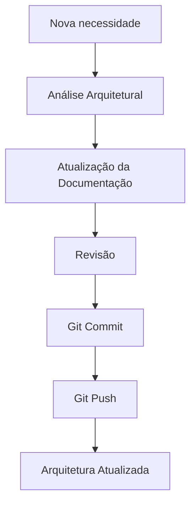

# MANUAL MESTRE DA ARQUITETURA EMPRESARIAL

> Documento oficial de navegação da Arquitetura Empresarial do Projeto Jason.

---

# Visão Geral

O Manual Mestre é a porta de entrada da Arquitetura Empresarial do Projeto Jason.

Seu objetivo é organizar toda a documentação arquitetural, padronizar a navegação entre os artefatos e acompanhar a evolução da arquitetura ao longo do ciclo de vida do projeto.

Toda documentação criada deverá estar vinculada a este manual.

---

# Objetivos

- Centralizar toda a documentação arquitetural.
- Definir a estrutura oficial da arquitetura.
- Facilitar a navegação entre documentos.
- Padronizar processos e governança.
- Servir como referência para equipes humanas e agentes de IA.

---

# Estrutura da Arquitetura

```
docs/
└── architecture/
    ├── DIRETORIAS/
    ├── DEPARTAMENTOS/
    ├── AGENTES/
    ├── PROCESSOS/
    ├── DIAGRAMAS/
    ├── ADR/
    ├── ESPECIFICACOES/
    ├── BACKLOG/
    ├── ARQUITETURA_EMPRESARIAL_V2.md
    ├── ORGANOGRAMA.md
    └── 01_MANUAL_MESTRE.md
```

---

# Documentação Principal

## Fundação

| Documento | Status |
|-----------|:------:|
| Arquitetura Empresarial V2 | ✅ |
| Organograma Empresarial | ✅ |
| Manual Mestre | ✅ |

---

## Diretorias

Documentação completa das diretorias corporativas responsáveis pela gestão estratégica da organização.

Status: ✅

---

## Departamentos

Documentação completa dos departamentos responsáveis pela execução operacional da empresa.

Status: ✅

---

## Agentes

Catálogo dos agentes inteligentes utilizados pelo Projeto Jason.

Status: ✅

---

## Processos

Macroprocessos corporativos.

Status:

- ✅ Processo de Desenvolvimento de Produto
- ✅ Processo de Governança de IA

---

## Diagramas

Modelagem visual da arquitetura.

Status: ⏳ Em evolução.

---

## ADR (Architecture Decision Records)

Registro oficial das decisões arquiteturais.

Status: ⏳ Em evolução.

---

## Especificações

Documentação técnica detalhada.

Status: ⏳ Em evolução.

---

## Backlog

Lista oficial das evoluções arquiteturais.

Status: ⏳ Em evolução.

---

# Estado Atual da Arquitetura

## Concluído

- Arquitetura Empresarial
- Organograma
- Diretorias
- Departamentos
- Agentes
- Processo de Desenvolvimento de Produto
- Processo de Governança de IA

---

## Em Desenvolvimento

- Diagramas
- ADR
- Especificações
- Backlog

---

# Princípios Arquiteturais

A Arquitetura Empresarial do Projeto Jason segue os seguintes princípios:

- Organização orientada por processos.
- Estrutura baseada em diretorias e departamentos.
- Governança corporativa integrada.
- IA como capacidade organizacional.
- Separação entre estratégia, operação e tecnologia.
- Evolução contínua da arquitetura.
- Documentação como fonte única da verdade.

---

# Governança da Documentação

Toda alteração arquitetural deverá:

1. Atualizar a documentação correspondente.
2. Ser registrada via Git.
3. Possuir histórico de commits.
4. Manter consistência entre documentos.
5. Atualizar este Manual Mestre quando necessário.

---

# Fluxo de Evolução



---

# Roadmap Arquitetural

## Curto Prazo

- Finalizar Diagramas
- Finalizar ADR
- Consolidar Especificações

---

## Médio Prazo

- Integração entre agentes
- Governança automatizada
- Indicadores arquiteturais

---

## Longo Prazo

- Jason CLI
- Automação de workflows
- Arquitetura autoevolutiva
- Governança inteligente

---

# Referências

- Arquitetura Empresarial V2
- Organograma Empresarial
- Diretorias
- Departamentos
- Agentes
- Processos
- ADR
- Especificações
- Diagramas
- Backlog

---

# Controle de Versão

Documento mantido pelo Projeto Jason.

Toda evolução da Arquitetura Empresarial deverá ser refletida neste Manual Mestre, que constitui a referência oficial para navegação e governança da documentação.