Crie o conteúdo completo deste arquivo em Markdown.

Título:

# ADR-0002 — Organização por Diretorias

Este documento deve seguir o padrão Architecture Decision Record (ADR).

Estrutura:

- Título
- Status: Aceito
- Data
- Contexto
- Problema
- Decisão
- Justificativa
- Benefícios
- Consequências
- Alternativas Consideradas
- Impacto na Arquitetura Empresarial
- Próximos Passos

Explique que o Projeto Jason adota uma arquitetura organizacional baseada em diretorias para separar responsabilidades, facilitar a governança, permitir escalabilidade, reduzir acoplamento entre áreas e proporcionar autonomia operacional.

Documente as seguintes diretorias:

- Diretoria de Estratégia
- Diretoria de Engenharia
- Diretoria de Inteligência Artificial
- Diretoria de Dados
- Diretoria de Memória e Conhecimento
- Diretoria de Infraestrutura
- Diretoria de Segurança
- Diretoria Financeira
- Diretoria Jurídica
- Diretoria de Marketing
- Diretoria Comercial e Parcerias
- Diretoria de Operações
- Diretoria de Recursos Humanos
- Diretoria de Inovação

Inclua uma seção explicando a relação entre:

CEO Jason
→ Diretorias
→ Departamentos
→ Agentes de IA

Inclua um diagrama Mermaid utilizando:

```mermaid
graph TD
    CEO["CEO Jason"]

    CEO --> Estrategia["Diretoria de Estratégia"]
    CEO --> Engenharia["Diretoria de Engenharia"]
    CEO --> IA["Diretoria de Inteligência Artificial"]
    CEO --> Dados["Diretoria de Dados"]
    CEO --> Memoria["Diretoria de Memória e Conhecimento"]
    CEO --> Infra["Diretoria de Infraestrutura"]
    CEO --> Seguranca["Diretoria de Segurança"]
    CEO --> Financeira["Diretoria Financeira"]
    CEO --> Juridica["Diretoria Jurídica"]
    CEO --> Marketing["Diretoria de Marketing"]
    CEO --> Comercial["Diretoria Comercial e Parcerias"]
    CEO --> Operacoes["Diretoria de Operações"]
    CEO --> RH["Diretoria de Recursos Humanos"]
    CEO --> Inovacao["Diretoria de Inovação"]

    Estrategia --> Departamentos
    Engenharia --> Departamentos
    IA --> Agentes
    Dados --> Agentes
    Memoria --> Agentes
```

O documento deve ser detalhado, profissional, em Markdown e compatível com toda a arquitetura empresarial do Projeto Jason.s