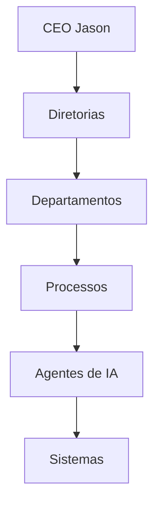

# ADR-0003 — Organização por Departamentos

- **Status:** Aceito
- **Data:** 2026-07-27

## Contexto

O Projeto Jason opera como um ecossistema empresarial orientado por inteligência artificial, integrando estratégia, tecnologia, dados, governança, segurança, operações e inovação em uma arquitetura modular e escalável. Para garantir coerência operacional, especialização funcional e governança institucional, tornou-se necessário estabelecer uma estrutura organizacional baseada em departamentos especializados, vinculados às diretorias corporativas.

A organização por departamentos foi adotada como modelo estrutural para permitir:

- alta especialização funcional;
- clareza de responsabilidades;
- padronização de processos;
- escalabilidade operacional;
- autonomia de execução dentro de cada domínio;
- governança mais precisa e rastreável.

## Problema

O crescimento do Projeto Jason exigia uma estrutura capaz de suportar múltiplos domínios de atuação sem comprometer eficiência, integração e rastreabilidade. A ausência de uma organização por departamentos especializados poderia levar a:

- sobreposição de responsabilidades;
- baixa clareza de accountability;
- dificuldade de governança e tomada de decisão;
- fricção entre áreas funcionais;
- baixa escalabilidade diante do aumento de agentes, processos e projetos.

Era necessário definir uma forma de organização que preservasse a coerência da arquitetura empresarial, sem sacrificar autonomia operacional nem a capacidade de evolução contínua.

## Decisão

Adotar a organização do Projeto Jason em departamentos especializados, vinculados às diretorias, como estrutura operacional padrão da arquitetura empresarial.

Essa decisão estabelece que cada diretoria concentra responsabilidade funcional e cada departamento atua como unidade operacional especializada, responsável por processos, entregas e governança interna dentro do domínio correspondente.

A estrutura organizacional passa a ser composta por:

- um núcleo executivo, representado por CEO Jason;
- diretorias especializadas por função corporativa;
- departamentos operacionais vinculados a cada diretoria;
- agentes de IA e agentes especializados apoiando a execução dos processos.

## Justificativa

A organização por departamentos é a alternativa mais adequada para o Projeto Jason porque:

- permite especialização profunda em cada área de atuação;
- melhora a governança ao separar responsabilidades e definir ownership claro;
- facilita a padronização de processos e de documentação;
- melhora a escalabilidade do ecossistema sem aumentar a complexidade de coordenação de forma descontrolada;
- cria uma base sólida para automação, orquestração e integração entre agentes;
- promove maior consistência com a arquitetura empresarial, que valoriza modularidade, rastreabilidade e evolução incremental.

## Benefícios

- Clareza organizacional e funcional.
- Maior capacidade de governança e auditoria.
- Melhor alinhamento entre estratégia, execução e operação.
- Maior capacidade de especialização técnica e funcional.
- Redução de conflitos e sobreposição de responsabilidades.
- Facilidade de expansão do ecossistema com novos agentes, processos e produtos.
- Melhor suporte à memória institucional e à documentação oficial.

## Consequências

- A organização passa a depender de mecanismos mais robustos de integração entre departamentos.
- A comunicação entre áreas deve ser formalizada para evitar silos.
- Cada departamento precisa manter padrões documentais e operacionais consistentes.
- O sucesso da arquitetura depende diretamente da governança entre diretorias e departamentos.
- O aumento da especialização exige maior maturidade em gestão de processos e de agentes.

## Alternativas Consideradas

1. Estrutura centralizada e verticalizada
   - Menos flexível e mais dependente de um controle central rígido.
   - Reduz autonomia operacional e dificulta escalabilidade.

2. Estrutura matricial
   - Permite maior flexibilidade, mas aumenta complexidade de governança e autoridade.
   - Pode gerar conflitos de prioridade entre áreas e comprometer rastreabilidade.

3. Estrutura por produtos
   - Adequada para ambientes de produto, porém menos alinhada ao modelo corporativo transversal do Projeto Jason.
   - Torna mais difícil a especialização funcional por domínio.

4. Estrutura por departamentos especializados
   - Escolhida por oferecer maior coerência com o modelo arquitetural do Projeto Jason, combinando especialização, governança e escalabilidade.

## Impacto na Arquitetura Empresarial

A adoção da organização por departamentos fortalece a arquitetura empresarial do Projeto Jason ao:

- reforçar o princípio de modularidade;
- apoiar a governança corporativa e a gestão de decisões;
- estruturar a execução das funções estratégicas, tecnológicas e operacionais;
- facilitar a integração entre agentes, processos e sistemas;
- melhorar a rastreabilidade do conhecimento, das decisões e dos produtos;
- preparar a organização para expansão contínua de soluções de IA e automações.

## Próximos Passos

- formalizar os departamentos e seus papéis em documentos oficiais;
- definir claramente os fluxos de comunicação e responsabilidade entre diretorias e departamentos;
- consolidar indicadores de desempenho e governança por departamento;
- manter atualização contínua do catálogo de agentes e da arquitetura organizacional;
- revisar periodicamente a estrutura à medida que novos produtos, agentes e processos forem incorporados.

## Departamento de Planejamento Estratégico

### Objetivo
Garantir a definição de metas, direções e prioridades institucionais do Projeto Jason.

### Missão
Orientar o crescimento da organização com base em visão, cenário, impacto e alinhamento estratégico.

### Responsabilidades
- definir metas e indicadores de longo prazo;
- apoiar priorização de iniciativas;
- revisar cenários, riscos e oportunidades;
- alinhar estratégia com execução.

### Principais processos
- revisão estratégica;
- planejamento anual;
- gestão de portfólio e prioridades;
- acompanhamento de OKRs e metas corporativas.

### Indicadores (KPIs)
- taxa de cumprimento das metas;
- percentual de iniciativas alinhadas à estratégia;
- tempo de revisão de planos.

### Sistemas utilizados
- painel executivo;
- ferramentas de gestão de portfólio;
- repositório documental institucional.

### Agentes de IA responsáveis
- Agente Estratégico;
- Agente de Planejamento;
- Agente de Portfólio.

### Relação com outras áreas
- integra-se com Governança, Arquitetura Empresarial, Engenharia, Financeiro e Operações.

## Departamento de Arquitetura Empresarial

### Objetivo
Manter a coerência estrutural da organização e da arquitetura corporativa.

### Missão
Preservar a integridade e a evolução do modelo organizacional, tecnológico e operacional.

### Responsabilidades
- mapear padrões e princípios arquiteturais;
- avaliar impactos de mudanças;
- apoiar integração entre áreas;
- preservar coerência entre estratégia e execução.

### Principais processos
- revisão arquitetural;
- análise de impacto de mudanças;
- padronização de referenciais;
- atualização do modelo institucional.

### Indicadores (KPIs)
- percentual de iniciativas compatíveis com a arquitetura;
- tempo médio de revisão de mudanças;
- grau de aderência aos padrões institucionais.

### Sistemas utilizados
- repositório de arquitetura;
- catálogo de agentes;
- ferramentas de modelagem e governança.

### Agentes de IA responsáveis
- Agente de Arquitetura Empresarial;
- Agente de Governança.

### Relação com outras áreas
- conecta Estratégia, Engenharia, Dados, Infraestrutura e Segurança.

## Departamento de Engenharia de Software

### Objetivo
Entregar soluções digitais estáveis, escaláveis e alinhadas à arquitetura institucional.

### Missão
Transformar requisitos e arquitetura em soluções tecnológicas robustas e operáveis.

### Responsabilidades
- desenvolver aplicações e serviços;
- integrar sistemas e agentes;
- garantir qualidade técnica;
- apoiar entrega e manutenção das soluções.

### Principais processos
- desenvolvimento;
- integração contínua;
- testes e validação;
- implantação e suporte técnico.

### Indicadores (KPIs)
- taxa de entrega no prazo;
- cobertura de testes;
- percentual de defeitos recorrentes.

### Sistemas utilizados
- repositório de código;
- pipelines de CI/CD;
- ferramentas de testes e observabilidade.

### Agentes de IA responsáveis
- Agente de Engenharia;
- Agente de Arquitetura;
- Agente DevOps.

### Relação com outras áreas
- integra-se com Infraestrutura, Dados, IA, Segurança e Operações.

## Departamento de Inteligência Artificial

### Objetivo
Desenvolver e governar soluções cognitiva e automatizada alinhadas à estratégia corporativa.

### Missão
Ampliar a inteligência operacional do ecossistema com soluções de IA seguras, úteis e governadas.

### Responsabilidades
- projetar modelos e pipelines de IA;
- avaliar desempenho e risco;
- integrar soluções cognitivas em produtos e processos;
- apoiar governança de modelos.

### Principais processos
- desenvolvimento de modelos;
- validação de desempenho;
- monitoramento operacional;
- governança e retraining.

### Indicadores (KPIs)
- precisão dos modelos;
- tempo de implantação;
- taxa de adoção das soluções de IA.

### Sistemas utilizados
- plataformas de ML/AI;
- repositórios de modelos;
- ferramentas de observabilidade e experimentação.

### Agentes de IA responsáveis
- Agente de IA;
- Agente de Modelos;
- Agente de Avaliação e Supervisão.

### Relação com outras áreas
- opera em conjunto com Engenharia, Dados, Memória, Segurança e Operações.

## Departamento de Dados

### Objetivo
Garantir dados confiáveis, governados e utilizáveis em decisões e soluções de IA.

### Missão
Sustentar o ecossistema com uma base de dados íntegra, rastreável e estrategicamente relevante.

### Responsabilidades
- gerenciar ingestão e integração de dados;
- manter qualidade e rastreabilidade;
- apoiar analytics e decisões;
- governar metadados e acesso.

### Principais processos
- ingestão de dados;
- limpeza e validação;
- catalogação e governança;
- publicação para consumo institucional.

### Indicadores (KPIs)
- qualidade dos dados;
- disponibilidade de repositórios;
- cobertura de governança de metadados.

### Sistemas utilizados
- bancos de dados;
- data warehouses;
- ferramentas de ETL/ELT;
- catálogos de dados.

### Agentes de IA responsáveis
- Agente de Dados;
- Agente de Governança de Dados;
- Agente de Analytics.

### Relação com outras áreas
- integra-se com IA, Memória, Engenharia, Segurança e Estratégia.

## Departamento de Memória e Conhecimento

### Objetivo
Preservar e disponibilizar o conhecimento institucional de forma contextualizada e recuperável.

### Missão
Garantir que o Projeto Jason preserve e reutilize o conhecimento acumulado por agentes, equipes e processos.

### Responsabilidades
- organizar documentos e registros;
- manter a memória institucional;
- indexar conteúdo e contexto;
- apoiar recuperação de conhecimento para decisões.

### Principais processos
- indexação semântica;
- atualização da memória institucional;
- recuperação de contexto;
- rastreabilidade documental.

### Indicadores (KPIs)
- taxa de recuperação de contexto;
- cobertura documental indexada;
- tempo de recuperação de informação.

### Sistemas utilizados
- repositório documental;
- mecanismos de busca semântica;
- ferramentas de memória institucional.

### Agentes de IA responsáveis
- Agente de Memória;
- Agente de Conhecimento;
- Agente de Documentação.

### Relação com outras áreas
- suporta Estratégia, Engenharia, IA, Dados e Operações.

## Departamento de Infraestrutura

### Objetivo
Disponibilizar uma base tecnológica estável, escalável e resiliente.

### Missão
Sustentar o funcionamento de sistemas, agentes e processos com alta disponibilidade.

### Responsabilidades
- gerenciar ambientes e plataformas;
- monitorar disponibilidade e performance;
- garantir recuperação de falhas;
- apoiar expansão operacional.

### Principais processos
- provisionamento;
- monitoramento e observabilidade;
- continuidade operacional;
- automatização de plataforma.

### Indicadores (KPIs)
- disponibilidade dos ambientes;
- tempo médio de recuperação;
- eficiência de provisionamento.

### Sistemas utilizados
- cloud e virtualização;
- ferramentas de observabilidade;
- monitoramento e backup.

### Agentes de IA responsáveis
- Agente de Infraestrutura;
- Agente de Cloud;
- Agente SRE.

### Relação com outras áreas
- integra-se com Engenharia, Segurança, Dados e Operações.

## Departamento de Segurança

### Objetivo
Proteger ativos, dados, agentes e processos contra riscos internos e externos.

### Missão
Assegurar integridade, confidencialidade, disponibilidade e conformidade no ecossistema Jason.

### Responsabilidades
- definir controles e políticas de segurança;
- monitorar incidentes e vulnerabilidades;
- avaliar conformidade e riscos;
- suportar resposta a incidentes.

### Principais processos
- gestão de riscos;
- resposta a incidentes;
- controle de acesso;
- avaliações e auditorias de segurança.

### Indicadores (KPIs)
- taxa de incidentes;
- tempo de resposta a incidentes;
- percentual de vulnerabilidades corrigidas.

### Sistemas utilizados
- SIEM;
- ferramentas de vulnerabilidade;
- sistemas de identidade e acesso.

### Agentes de IA responsáveis
- Agente de CyberSecurity;
- Agente de Compliance;
- Agente de Resposta a Incidentes.

### Relação com outras áreas
- integra-se com Engenharia, Infraestrutura, Dados, Jurídico e Operações.

## Departamento Financeiro

### Objetivo
Gerenciar recursos, custos e sustentabilidade econômica da organização.

### Missão
Preservar a saúde financeira do Projeto Jason e apoiar decisões de investimento.

### Responsabilidades
- planejar orçamento e previsão;
- acompanhar custos e receitas;
- apoiar análise de investimento;
- controlar despesas e conformidade financeira.

### Principais processos
- planejamento financeiro;
- controle orçamentário;
- análise de custos;
- relatórios financeiros.

### Indicadores (KPIs)
- cumprimento orçamentário;
- precisão de previsão;
- eficiência de custos.

### Sistemas utilizados
- sistemas contábeis;
- ferramentas de BI e orçamento;
- repositórios financeiros.

### Agentes de IA responsáveis
- Agente Financeiro;
- Agente de Custos;
- Agente de Planejamento Financeiro.

### Relação com outras áreas
- integra-se com Estratégia, Operações, Comercial e Jurídico.

## Departamento Jurídico

### Objetivo
Proteger a organização frente a riscos legais, regulatórios e contratuais.

### Missão
Assegurar que a atuação do Projeto Jason esteja alinhada à legislação e à governança institucional.

### Responsabilidades
- revisar contratos;
- avaliar conformidade regulatória;
- apoiar decisões jurídicas;
- prescrever políticas e riscos legais.

### Principais processos
- análise contratual;
- compliance regulatório;
- pareceres jurídicos;
- gestão de riscos jurídicos.

### Indicadores (KPIs)
- tempo médio de resposta jurídica;
- taxa de conformidade;
- redução de exposição regulatória.

### Sistemas utilizados
- repositório documental jurídico;
- ferramentas de gestão de contratos;
- bases regulatórias.

### Agentes de IA responsáveis
- Agente Jurídico;
- Agente de Contratos;
- Agente de Compliance Regulatório.

### Relação com outras áreas
- integra-se com Segurança, Financeiro, Comercial e Estratégia.

## Departamento de Marketing

### Objetivo
Fortalecer a presença institucional e a percepção de valor do Projeto Jason.

### Missão
Comunicar com clareza os produtos, serviços e capacidades do ecossistema.

### Responsabilidades
- definir branding e comunicação;
- planejar campanhas;
- apoiar posicionamento e relacionamento;
- acompanhar percepção de marca.

### Principais processos
- marketing institucional;
- comunicação e conteúdo;
- branding e campanhas;
- análise de percepção.

### Indicadores (KPIs)
- alcance e engajamento;
- percepção de marca;
- conversão em oportunidade comercial.

### Sistemas utilizados
- ferramentas de marketing digital;
- plataformas de CRM e conteúdo.

### Agentes de IA responsáveis
- Agente de Marketing;
- Agente de Conteúdo;
- Agente de Branding.

### Relação com outras áreas
- integra-se com Comercial, Estratégia e Inovação.

## Departamento Comercial e Parcerias

### Objetivo
Transformar capacidades organizacionais em oportunidades comerciais e parcerias estratégicas.

### Missão
Expandir o alcance do Projeto Jason por meio de relacionamento comercial sustentado.

### Responsabilidades
- prospecção e relacionamento;
- negociação e gestão de oportunidades;
- desenvolvimento de parcerias;
- apoiar expansão comercial.

### Principais processos
- prospecção;
- relacionamento comercial;
- negociação;
- gestão de parcerias.

### Indicadores (KPIs)
- número de oportunidades qualificadas;
- taxa de conversão;
- receita e parcerias fechadas.

### Sistemas utilizados
- CRM;
- ferramentas comerciais;
- sistemas de gestão de contratos.

### Agentes de IA responsáveis
- Agente Comercial;
- Agente de Relacionamento;
- Agente de Parcerias Comerciais.

### Relação com outras áreas
- integra-se com Marketing, Estratégia, Financeiro, Jurídico e Operações.

## Departamento de Operações

### Objetivo
Garantir execução contínua, previsível e rastreável dos processos institucionais.

### Missão
Manter a organização funcionando com eficiência operacional e continuidade de serviço.

### Responsabilidades
- acompanhar processos críticos;
- gerir demanda e incidentes; 
- apoiar execução e continuidade;
- monitorar indicadores operacionais.

### Principais processos
- gestão de processos;
- suporte operacional;
- incident response;
- melhoria contínua.

### Indicadores (KPIs)
- tempo de execução;
- taxa de sucesso operacional;
- tempo de resposta a incidentes.

### Sistemas utilizados
- sistemas de gestão de processos;
- ferramentas de monitoramento;
- painéis operacionais.

### Agentes de IA responsáveis
- Agente de Operações;
- Agente de Suporte;
- Agente de Processos.

### Relação com outras áreas
- integra-se com Engenharia, Infraestrutura, Financeiro, Comercial e RH.

## Departamento de Recursos Humanos

### Objetivo
Cuidar do capital humano necessário para operar e evoluir o Projeto Jason.

### Missão
Desenvolver, alinhar e preservar as capacidades humanas da organização.

### Responsabilidades
- recrutamento e integração;
- capacitação e desenvolvimento;
- gestão de desempenho;
- apoio à cultura organizacional.

### Principais processos
- recrutamento;
- onboarding;
- treinamento;
- gestão de performance.

### Indicadores (KPIs)
- retenção de talentos;
- tempo de contratação;
- taxa de engajamento.

### Sistemas utilizados
- sistemas de RH;
- plataformas de treinamento;
- ferramentas de avaliação de performance.

### Agentes de IA responsáveis
- Agente de RH;
- Agente de Desenvolvimento Organizacional;
- Agente de Capacitação.

### Relação com outras áreas
- integra-se com Estratégia, Engenharia, Operações e Inovação.

## Departamento de Gestão de Portfólio

### Objetivo
Priorizar e acompanhar iniciativas para maximizar valor e alinhamento estratégico.

### Missão
Garantir que as iniciativas do Projeto Jason sejam viáveis, priorizadas e bem executadas.

### Responsabilidades
- priorizar projetos;
- acompanhar marcos e dependências;
- apoiar replanejamento;
- alinhar portfólio com objetivos estratégicos.

### Principais processos
- triagem e priorização;
- acompanhamento de execução;
- revisão de portfólio;
- análise de risco e dependência.

### Indicadores (KPIs)
- percentual de projetos priorizados corretamente;
- cumprimento de marcos;
- alinhamento do portfólio com estratégia.

### Sistemas utilizados
- gestor de portfólio;
- ferramentas de rastreio de projetos.

### Agentes de IA responsáveis
- Agente de Portfólio;
- Agente de Planejamento.

### Relação com outras áreas
- integra-se com Estratégia, Governança, Engenharia e Financeiro.

## Departamento de Governança

### Objetivo
Assegurar coerência, rastreabilidade e conformidade das decisões corporativas.

### Missão
Garantir que as decisões, processos e mudanças sejam conduzidos de forma responsável e controlada.

### Responsabilidades
- definir políticas de governança;
- registrar decisões e mudanças;
- acompanhar conformidade;
- apoiar auditorias e controles internos.

### Principais processos
- governança de decisões;
- revisão de mudanças;
- auditoria documental;
- gestão de políticas e controles.

### Indicadores (KPIs)
- percentual de decisões registradas;
- cobertura de auditoria;
- taxa de conformidade.

### Sistemas utilizados
- catálogo de agentes;
- ferramentas de governança e auditoria;
- repositório documental institucional.

### Agentes de IA responsáveis
- Agente de Governança;
- Agente de Arquitetura Empresarial.

### Relação com outras áreas
- atua transversalmente com todas as áreas da organização.

## Diagrama Mermaid

## Conclusão

A organização por departamentos representa uma decisão estrutural essencial para o Projeto Jason, permitindo alta especialização operacional, governança consistente, escalabilidade controlada e integração entre estratégia, tecnologia, processo e agentes de IA. Esse modelo fortalece a maturidade organizacional e sustenta a evolução contínua da arquitetura empresarial.
