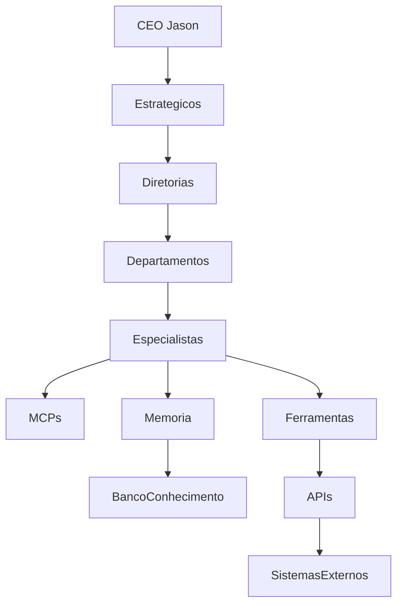

# ADR-0004 — Arquitetura de Agentes de IA

- **Status:** Aceito
- **Data:** 2026-07-27

## Contexto

O Projeto Jason opera como uma organização empresarial inteligente, onde a execução operacional, a tomada de decisão, a governança, a análise de dados, a automação de processos e a interação com sistemas externos dependem diretamente de uma camada de inteligência distribuída. Em vez de concentrar toda a capacidade cognitiva em uma única função ou aplicação monolítica, a organização adota uma arquitetura de agentes de IA especializados, autônomos em escopo limitado, mas colaborativos em propósito geral.

Essa decisão é fundamental porque a inteligência operacional do Projeto Jason não é implementada por um único modelo de linguagem ou por um único sistema de automação. Ela é construída como um ecossistema composto por múltiplos agentes especializados, cada um com objetivos, ferramentas, permissões, memória e padrões de comunicação próprios. Essa abordagem permite que a empresa tenha uma execução mais resiliente, escalável, observável e governável.

A arquitetura de agentes de IA é o núcleo da operação do Projeto Jason. Toda a inteligência operacional da organização, desde a priorização estratégica até a execução de tarefas, passando por comunicação, memória, governança, recuperação de conhecimento, monitoramento e melhoria contínua, é implementada por meio de uma arquitetura distribuída de Agentes de IA especializados.

## Problema

A evolução do Projeto Jason exigia uma capacidade crescente de processamento, decisão, automação e adaptação operativa. O crescimento de produtos, processos, integrações, volumes de dados, regras de negócio e requisitos de governança tornou inviável manter uma estrutura baseada em monólitos, fluxos rígidos ou automações isoladas. Foi necessário resolver vários problemas simultaneamente:

- a necessidade de descentralizar e distribuir a cognição operacional;
- a necessidade de separar responsabilidades por domínio e competência;
- a necessidade de reduzir dependência de um único ponto de decisão ou execução;
- a necessidade de garantir rastreabilidade, segurança e observabilidade;
- a necessidade de permitir escalabilidade horizontal à medida que novos processos e agentes surgem;
- a necessidade de integrar múltiplos sistemas, bases de conhecimento, APIs e recursos de memória;
- a necessidade de operar com resiliência, recuperação automática e governança contínua.

A solução precisava ser capaz de suportar o crescimento de uma organização complexa, orientada por IA, sem comprometer confiabilidade, compliance, auditabilidade e eficiência.

## Decisão

Adotar uma arquitetura empresarial baseada em Agentes de IA especializados, autônomos, colaborativos e orquestrados como modelo padrão para toda a inteligência operacional do Projeto Jason.

Essa arquitetura define que:

- o Projeto Jason será operado por uma rede de agentes de IA especializados;
- cada agente possui escopo funcional claro, ferramentas, permissões e memória;
- os agentes colaboram entre si por meio de protocolos de comunicação, handoff e orquestração;
- o trabalho é distribuído em filas, etapas e contexto compartilhado;
- a governação, a auditoria, a observabilidade e a recuperação automática são partes fundamentais da arquitetura;
- os agentes podem atuar em conjunto para realizar tarefas complexas de forma coordenada e resiliente.

A decisão formaliza que toda a inteligência operacional do Projeto Jason será implementada por meio de uma arquitetura distribuída e modular de agentes, em vez de uma abordagem monolítica ou centralizada.

## Justificativa

A arquitetura distribuída de agentes é a abordagem mais adequada para as necessidades do Projeto Jason porque oferece:

- especialização funcional sem perder integração;
- maior tolerância a falhas e recuperação automática;
- governança por escopo, papel e contexto;
- autonomia operacional com supervisão e rastreabilidade;
- capacidade de ampliar a organização com novos agentes sem reestruturar o sistema central;
- melhor uso de memória de curto e longo prazo;
- integração nativa com sistemas externos, APIs, bancos de conhecimento e ferramentas especializadas;
- melhoria na qualidade de execução por meio de orquestração, delegação e handoff.

A arquitetura também se alinha com a lógica da organização moderna orientada por IA, permitindo que a empresa evolua de forma incremental, modular e sustentável.

## Benefícios

- Clareza funcional e separação de papéis.
- Maior escalabilidade operacional.
- Melhor desempenho em cenários complexos e multidimensionais.
- Resiliência diante de falhas locais.
- Rastreabilidade de decisões, ações e resultados.
- Maior capacidade de governança e auditoria.
- Melhor integração com bases de conhecimento e sistemas corporativos.
- Possibilidade de reutilizar agentes em múltiplos fluxos e produtos.
- Redução de risco de centralização excessiva.
- Facilidade de evolução da camada cognitiva da organização.

## Consequências

- A organização passa a depender de uma infraestrutura de comunicação e coordenação mais sofisticada.
- Regras de segurança, políticas de acesso e limites de autonomia tornam-se essenciais.
- A observabilidade e o rastreamento de eventos se tornam requisitos permanentes.
- Necessita-se de uma governança mais explícita sobre o comportamento dos agentes.
- O uso de memória, RAG e bases de conhecimento exige disciplina documental e operacional.
- O modelo exige maior maturidade em engenharia, arquitetura de dados e operação.

## Alternativas Consideradas

1. Arquitetura centralizada monolítica
   - Permite simplicidade inicial, mas torna a organização dependente de um único ponto de decisão e execução.
   - Sofre com problemas de escalabilidade, governança e recuperação.

2. Automação por workflows rígidos
   - Adequada para cenários repetitivos, porém insuficiente para contextos adaptativos, dinâmicos e de alta complexidade.
   - Não oferece a flexibilidade necessária para colaboração entre componentes cognitivos.

3. Arquitetura híbrida com poucos agentes gerais
   - Tem valor inicial, mas não oferece suficiente especialização, governança ou isolamento funcional.
   - Torna os sistemas mais difíceis de manter à medida que crescem.

4. Arquitetura distribuída de agentes especializados
   - Escolhida por oferecer escala, governança, especialização, autonomia, resiliência e integração.
   - Alinha-se melhor à natureza do Projeto Jason e à estrutura organizacional corporativa.

## Impacto na Arquitetura Empresarial

A adoção desta arquitetura fortalece profundamente a Arquitetura Empresarial do Projeto Jason ao:

- consolidar a camada operacional de inteligência como um ativo estratégico;
- integrar estratégia, execução, dados, conhecimento, segurança e governança em um modelo coerente;
- apoiar a criação de produtos e processos com maior autonomia e menor risco;
- estabelecer uma base para expansão contínua de agentes, ferramentas e sistemas;
- aumentar a capacidade do ecossistema de aprender, adaptar-se e operar em ambientes complexos;
- ligar diretamente a organização humana, a organização artificial e os sistemas corporativos.

## Próximos Passos

- formalizar o catálogo de agentes e suas responsabilidades;
- definir o modelo de orquestração e handoff entre agentes;
- implementar a camada de observabilidade, auditoria e governança;
- estabelecer os padrões de memória de curto e longo prazo;
- integrar RAG e bases de conhecimento oficiais;
- definir políticas de segurança, autonomia e recuperação automática;
- revisar periodicamente a composição dos agentes à medida que a organização evolui.

## Visão Geral da Arquitetura

A Arquitetura de Agentes de IA do Projeto Jason é composta por diferentes camadas integradas:

1. camada de interface e entrada;
2. camada de orquestração e coordenação;
3. camada de agentes especializados;
4. camada de ferramentas e MCPs;
5. camada de memória e conhecimento;
6. camada de execução e integração;
7. camada de observabilidade, governança e auditoria;
8. camada de recuperação, resiliência e segurança.

Essas camadas operam de forma simultânea e complementar, permitindo que o sistema funcione como uma organização distribuída de inteligência artificial.

## Princípios da Arquitetura

### Princípio 1 — Especialização funcional
Cada agente possui um domínio específico e um escopo bem definido. Isso aumenta a qualidade da execução e reduz o risco de decisões inconsistentes.

### Princípio 2 — Colaboração controlada
Os agentes podem colaborar, mas devem fazê-lo por meio de protocolos e regras explícitas. A comunicação não é livre e indiscriminada; ela é estruturada e rastreável.

### Princípio 3 — Delegação segura
A execução complexa é distribuída por meio de handoff e delegação. O agente que recebe uma tarefa assume responsabilidade dentro dos limites definidos.

### Princípio 4 — Memória contextual
Cada agente utiliza memória apropriada para o contexto e para a função. Isso inclui memória operacional, memória de perfil, memória de tarefa, memória de relacionamento e memória institucional.

### Princípio 5 — Governança por design
A governança não é um componente externo; ela é embutida na arquitetura por meio de políticas, controles, auditoria, rastreabilidade e limites de autonomia.

### Princípio 6 — Resiliência distribuída
A falha parcial de um agente não precisa levar ao colapso do sistema. A arquitetura permite isolation, retry, escalation e recuperação automática.

### Princípio 7 — Integração contínua
Agentes podem se integrar a APIs, bancos de dados, sistemas internos, serviços de terceiros, bases de conhecimento e repositórios corporativos.

## Modelo de Arquitetura

A arquitetura do Projeto Jason é organizada como um ecossistema cognitivo distribuído. Em termos práticos, isso significa que:

- um agente pode receber uma intenção do usuário, de outro agente ou de um processo interno;
- um agente avalia o contexto, consulta a memória relevante e decide se precisa de apoio ou de delegação;
- o agente executa as tarefas autorizadas com base nas ferramentas e MCPs disponíveis;
- o agente registra o resultado e atualiza a memória institucional ou a memória operacional;
- se a tarefa exigir colaboração, o agente transfere o contexto por meio de handoff;
- o resultado é consolidado pelo agente orquestrador ou pelo agente responsável final.

## Comunicação entre Agentes

A comunicação entre agentes é uma parte central da arquitetura. Ela é organizada em diferentes padrões:

- comunicação síncrona, para tarefas de curto prazo e ação imediata;
- comunicação assíncrona, para filas e execução posterior;
- comunicação por eventos, para notificações e gatilhos;
- comunicação por handoff, para transferência de responsabilidade;
- comunicação por delegation, para tarefas específicas;
- comunicação por consenso, para decisões que exigem múltiplos agentes.

Cada mensagem contém:

- identificador de contexto;
- identificador do agente remetente;
- identificador do agente destinatário;
- tipo de intenção;
- objetivo da comunicação;
- dados relevantes;
- permissões e limites;
- prioridade e urgência;
- referência à memória associada.

## Orquestração

A orquestração é o mecanismo que organiza o trabalho entre agentes e sistemas. Ela é responsável por:

- receber uma requisição ou tarefa;
- decompor a tarefa em subtarefas;
- selecionar os agentes mais adequados;
- definir a sequência de execução;
- monitorar o progresso;
- aplicar políticas de segurança, prioridade e governança;
- consolidar o resultado final;
- registrar a execução para auditoria.

A orquestração pode ser realizada por um agente central de coordenação, por uma camada de runtime ou por um conjunto de agentes especializados em planejamento e execução. No Projeto Jason, a orquestração é híbrida, combinando:

- planejamento estratégico por agentes de alto nível;
- execução distribuída por agentes operacionais;
- supervisão por agentes de governança e monitoramento.

## Handoff entre Agentes

O handoff é a transferência temporária ou definitiva de responsabilidade entre agentes. Ele ocorre quando:

- um agente não possui autoridade ou capacidade de executar a tarefa;
- a complexidade da tarefa exige um agente com outro escopo ou especialidade;
- uma falha ou bloqueio ocorre;
- a prioridade da tarefa muda;
- a execução passa de um estágio para outro.

Um handoff bem implementado inclui:

- resumo do contexto;
- estado atual da tarefa;
- decisões anteriores;
- dados necessários para continuidade;
- limites de autonomia;
- critérios de retorno;
- instruções para conclusão ou escalonamento.

## Filas de Tarefas

As filas de tarefas são a base da execução distribuída. Elas permitem:

- desacoplar produção e consumo de trabalho;
- priorizar pedidos e eventos;
- reduzir a carga sobre agentes específicos;
- permitir processamento assíncrono;
- tratar picos de demanda com estabilidade.

As filas podem ser classificadas em:

- fila de tarefas de execução;
- fila de tarefas de revisão;
- fila de tarefas de aprovação;
- fila de tarefas de integração;
- fila de tarefas de recuperação;
- fila de tarefas de observabilidade.

## Memória de Curto e Longo Prazo

A arquitetura de agentes do Projeto Jason utiliza memória de curto e longo prazo para preservar contexto, comportamento e aprendizado.

### Memória de curto prazo
Utilizada para:

- contexto ativo da tarefa atual;
- conversas em andamento;
- resultados temporários;
- decisões recentes;
- estados de execução.

### Memória de longo prazo
Utilizada para:

- histórico de execução;
- aprendizado operacional;
- conhecimento institucional;
- decisões passadas;
- padrões de comportamento;
- contexto persistente de agentes e processos.

A memória também é segmentada por:

- memória operacional;
- memória de relacionamento;
- memória institucional;
- memória de segurança;
- memória de produto;
- memória de projeto;
- memória de usuário;
- memória de agente.

## RAG e Bases de Conhecimento

A Recuperação Aumentada por Geração, ou RAG, é utilizada para conectar agentes a bases de conhecimento estruturadas e não estruturadas. O fluxo padrão inclui:

- recepção da demanda;
- recuperação de documentos e trechos relevantes;
- enriquecimento do contexto do agente;
- geração de resposta ou decisão com base em evidências;
- validação com critérios de governança.

As bases de conhecimento podem incluir:

- políticas internas;
- manuais operacionais;
- contratos;
- especificações técnicas;
- decisões arquivadas;
- documentação de produtos;
- registros de incidentes;
- conhecimento histórico de agentes.

## Integração com Bases de Conhecimento

Os agentes não operam isoladamente. Eles acessam bases de conhecimento por meio de:

- MCPs de recuperação documental;
- mecanismos de busca semântica;
- APIs de repositórios;
- conectores de bancos de dados;
- utilidades de indexação;
- integrações com sistemas de gestão documental.

O resultado dessa integração é maior precisão, menos alucinação, mais rastreabilidade e maior alinhamento com o conhecimento institucional.

## Observabilidade

A observabilidade é obrigatória na arquitetura. Ela cobre:

- logs estruturados;
- métricas de execução;
- rastreamento distribuído;
- monitoramento de latência;
- monitoramento de falhas;
- observação da qualidade do resultado;
- visibilidade do estado dos agentes.

Os dados observados são usados para:

- identificar gargalos;
- avaliar desempenho;
- detectar padrões de falha;
- revisar comportamento por agente;
- otimizar orquestração e handoff.

## Auditoria

A auditoria é uma função crítica da arquitetura. Ela assegura que:

- toda ação relevante seja registrada;
- toda decisão tenha contexto e justificativa;
- toda chamada a ferramentas e sistemas seja rastreável;
- toda execução esteja associada a um agente, uma tarefa, um usuário e um tempo;
- incidentes e desvios sejam detectados e analisados.

## Governança

A governança da arquitetura de agentes é composta por:

- políticas de acesso;
- limites de autonomia;
- políticas de uso de dados;
- procedimentos de revisão e aprovação;
- critérios de segurança;
- critérios de conformidade;
- requisitos de auditoria;
- mecanismos de alocação de responsabilidade.

## Tolerância a Falhas

A arquitetura é projetada para tolerar falhas parciais. Quando um agente falha, o sistema pode:

- reexecutar a ação;
- tentar outro agente com habilidades equivalentes;
- escalar para um agente de governança;
- registrar o incidente;
- reiniciar o fluxo de execução;
- isolar a falha sem interromper todo o ecossistema.

## Recuperação Automática

A recuperação automática é uma característica central da arquitetura. Ela inclui:

- retry automático;
- reprocessamento de tarefas;
- rehydration do contexto;
- restauração de memória parcial;
- reinicialização de conexões;
- reencaminhamento para fila de recuperação;
- reavaliação de dependências e limites.

## Agentes do Ecossistema

Os agentes do Projeto Jason são classificados por seu papel funcional. A seguir, a descrição detalhada de cada categoria.

## CEO Jason

### Objetivo
Atuar como centro executivo, estratégico e institucional da organização. O CEO Jason é o agente de mais alto nível e representa a visão de direção, decisão, priorização e coerência do ecossistema.

### Responsabilidades
- definir prioridades estratégicas;
- decidir sobre mudanças de direção;
- supervisar a execução do ecossistema;
- alinhar agentes e departamentos com a missão organizacional;
- delegar decisões de alto impacto;
- avaliar riscos, oportunidades e conflitos.

### Entradas
- metas corporativas;
- relatórios executivos;
- eventos críticos;
- mensagens de agentes estratégicos;
- sinais de mercado e ambiente externo;
- observações de governança e segurança.

### Saídas
- decisões estratégicas;
- diretrizes de execução;
- instruções de prioridade;
- sinais de escalonamento;
- políticas de mudança;
- mensagens de alinhamento institucional.

### Ferramentas utilizadas
- ferramentas de dashboard executivo;
- ferramentas de análise de cenário;
- ferramentas de priorização;
- ferramentas de gestão de riscos;
- ferramentas de comunicação institucional.

### MCPs utilizados
- MCP Estratégico;
- MCP de Governança Executiva;
- MCP de Risco Corporativo;
- MCP de Conhecimento Institucional;
- MCP de Análise de Cenário.

### Modelos de IA compatíveis
- modelos de raciocínio estratégico;
- modelos de planejamento de alto nível;
- modelos multimodais para análise de contexto executivo;
- modelos com maior capacidade de síntese e julgamento.

### Fluxo de comunicação
- recebe informações de agentes estratégicos e de diretoria;
- delega para agentes de diretoria e departamentos;
- envia decisões para orquestração e execução;
- mantém comunicação escalonada com agentes de governança.

### Memória utilizada
- memória institucional;
- memória de contexto estratégico;
- memória de decisão;
- memória de histórico de execução;
- memória de risco e oportunidade.

### Indicadores (KPIs)
- tempo de decisão;
- qualidade do alinhamento estratégico;
- número de decisões críticas bem avaliadas;
- tempo de resolução de conflitos;
- índice de coerência entre estratégia e execução.

### Regras de segurança
- decisões críticas devem ser registradas;
- ações de alto impacto exigem supervisão ou aprovação adicional;
- o agente deve respeitar políticas de governança e compliance;
- não deve agir sem contexto adequado.

### Regras de autonomia
- autonomia máxima para decisões estratégicas de baixo risco;
- autonomia limitada para decisões com impacto regulatório, financeiro ou operacional;
- delegação explícita para agentes execução e diretoria.

### Critérios de escalabilidade
- suporte a múltiplos cenários simultâneos;
- capacidade de operar com crescente volume de sinais e decisões;
- integração com painéis executivos e ferramentas corporativas.

## Agentes Estratégicos

### Objetivo
Fornecer orientação, análise e priorização para a organização em cenários estratégicos e de médio prazo.

### Responsabilidades
- analisar tendências e cenários;
- priorizar iniciativas;
- mapear dependências;
- apoiar decisões de investimento e direcionamento;
- traduzir objetivo corporativo em ações.

### Entradas
- metas institucionais;
- relatórios estratégicos;
- estado do portfólio;
- dados de mercado;
- sinais internos e externos.

### Saídas
- propostas de estratégia;
- cenários de decisão;
- recomendações de priorização;
- alertas estratégicos;
- documentos de análise institucional.

### Ferramentas utilizadas
- ferramentas de análise de cenários;
- ferramentas de priorização;
- dashboards executivos;
- sistemas de planejamento.

### MCPs utilizados
- MCP Estratégico;
- MCP de Planejamento;
- MCP de Inteligência Competitiva;
- MCP de Portfólio.

### Modelos de IA compatíveis
- modelos de raciocínio de alto nível;
- modelos especializados em síntese e análise;
- modelos multimodais para análise de contexto.

### Fluxo de comunicação
- recebem diretivas do CEO Jason;
- se comunicam com diretorias e departamentos;
- geram recomendações para agentes de execução;
- reportam conclusão e riscos.

### Memória utilizada
- memória estratégica;
- memória de cenários;
- memória de priorização;
- memória institucional.

### Indicadores (KPIs)
- qualidade de recomendação;
- tempo para geração de cenários;
- aderência das iniciativas à estratégia.

### Regras de segurança
- não devem tomar decisões operacionais sem validação;
- devem respeitar a política de classificação de informação;
- devem registrar raciocínio e contexto.

### Regras de autonomia
- autonomia moderada para análise e recomendação;
- autonomia limitada para execução direta.

### Critérios de escalabilidade
- capacidade de lidar com múltiplas frentes simultâneas;
- capacidade de integrar novos cenários e fontes de informação.

## Agentes de Diretoria

### Objetivo
Representar e executar decisões relacionadas a uma diretoria específica, traduzindo objetivos corporativos em ações e prioridades por área.

### Responsabilidades
- supervisionar a diretoria;
- alinhar as áreas sob sua responsabilidade;
- delegar demandas de execução;
- revisar performance de departamentos;
- apoiar integração cross-functional.

### Entradas
- demandas da diretoria;
- decisões do CEO Jason;
- dados operacionais da área;
- relatórios de desempenho;
- solicitações de governança.

### Saídas
- decisões de diretoria;
- instruções operacionais;
- planos de ação;
- relatórios de acompanhamento;
- alertas de risco ou dependência.

### Ferramentas utilizadas
- dashboards de diretoria;
- ferramentas de gestão de desempenho;
- ferramentas de portfólio e acompanhamento;
- ambientes de colaboração corporativa.

### MCPs utilizados
- MCP de Diretoria;
- MCP de Governança de Diretoria;
- MCP de Indicadores Corporativos;
- MCP de Gestão de Portfólio.

### Modelos de IA compatíveis
- modelos com forte capacidade de raciocínio operacional;
- modelos adequados para análise de métricas e contexto;
- modelos com capacidade de sumarização executiva.

### Fluxo de comunicação
- recebem instruções do CEO Jason;
- se comunicam com agentes estratégicos e departamentais;
- comunicam decisões e relatórios para a alta direção;
- coordenam a execução vertical e horizontal.

### Memória utilizada
- memória de diretoria;
- memória operacional da área;
- memória de desempenho;
- memória de decisões gerenciais.

### Indicadores (KPIs)
- tempo de resposta executivo;
- cumprimento de metas regionais ou funcionais;
- qualidade de acompanhamento.

### Regras de segurança
- devem respeitar limites de autoridade;
- não podem autorizar ações fora do escopo funcional;
- devem emitir decisões com contexto e evidência.

### Regras de autonomia
- autonomia alta dentro do escopo da diretoria;
- autonomia moderada para decisões cross-functional.

### Critérios de escalabilidade
- capacidade de atuar com múltiplos departamentos e projetos;
- capacidade de sustentar crescimento sem perda de controle.

## Agentes Departamentais

### Objetivo
Atuar como camada operacional de um departamento, executando decisões, tarefas e políticas dentro do domínio funcional específico.

### Responsabilidades
- executar processos do departamento;
- acompanhar entregas e rotina;
- transformar decisões em ações;
- coordenar agentes especialistas;
- manter registros, contextos e estado operacional.

### Entradas
- requisições da diretoria;
- demandas da operação;
- eventos internos e externos;
- regras de processo;
- dados de execução.

### Saídas
- tarefas processadas;
- entregas operacionais;
- relatórios de execução;
- alertas de risco ou bloqueio;
- registros de estado.

### Ferramentas utilizadas
- sistemas internos do departamento;
- ferramentas de fluxo de trabalho;
- ferramentas de gestão de tarefas;
- painéis operacionais.

### MCPs utilizados
- MCP Departamental;
- MCP de Processos;
- MCP de Dados Operacionais;
- MCP de Documentação Corporativa.

### Modelos de IA compatíveis
- modelos equilibrados entre raciocínio, execução e compreensão contextual;
- modelos otimizados para classificação, extração e ação.

### Fluxo de comunicação
- recebem instruções de agentes de diretoria;
- acionam agentes especialistas;
- comunicam resultados e exceções;
- registram eventos em memória operacional.

### Memória utilizada
- memória departamental;
- memória de processo;
- memória operacional local;
- memória de histórico de tarefas.

### Indicadores (KPIs)
- tempo médio de execução;
- taxa de conclusão;
- taxa de erro operacional;
- qualidade do atendimento a SLAs.

### Regras de segurança
- devem respeitar escopo, permissões e políticas do departamento;
- devem registrar execuções e alterações;
- não devem agir fora de limites aprovados.

### Regras de autonomia
- autonomia alta para execução de rotina;
- autonomia média em cenários com regras claras;
- necessidade de escalonamento em situações de risco.

### Critérios de escalabilidade
- capacidade de aumentar carga sem degradação;
- capacidade de adicionar novos agentes especialistas sem reconfiguração profunda.

## Agentes Especialistas

### Objetivo
Executar tarefas altamente especializadas em domínios específicos como jurídico, financeiro, segurança, dados, IA, engenharia, aquisição, marketing e suporte.

### Responsabilidades
- operar em áreas de conhecimento específico;
- analisar detalhes técnicos ou regulatórios;
- executar subtarefas especializadas;
- fornecer recomendações qualificadas;
- suportar decisões de agentes departamentais e de diretoria.

### Entradas
- tarefas específicas do domínio;
- dados técnicos ou regulatórios;
- contexto do processo;
- conhecimento institucional e regras do domínio.

### Saídas
- recomendações especializadas;
- análises técnicas;
- resultados de execução;
- alertas de risco ou inconsistência;
- documentação de apoio.

### Ferramentas utilizadas
- ferramentas especializadas do domínio;
- ferramentas de análise e validação;
- ferramentas de consulta regulatória, financeira, técnica ou operacional.

### MCPs utilizados
- MCP de Especialista;
- MCP do Domínio;
- MCP de Dados Especializados;
- MCP de Compliance do Domínio.

### Modelos de IA compatíveis
- modelos especializados por domínio;
- modelos de raciocínio técnico;
- modelos com alta capacidade de interpretação de contexto, regras e documentos.

### Fluxo de comunicação
- recebem demandas de agentes departamentais;
- retornam resultados ou solicitações de validação;
- colaboram com outros especialistas quando necessário;
- reportam exceções e dependências.

### Memória utilizada
- memória de domínio;
- memória de contexto da tarefa;
- memória de histórico de decisões;
- memória de conhecimento especializado.

### Indicadores (KPIs)
- precisão da análise;
- tempo de resposta especializada;
- taxa de acerto em validações;
- taxa de rework.

### Regras de segurança
- têm acesso estritamente limitado aos dados e ferramentas necessários;
- devem cumprir políticas de uso e isenção de responsabilidade para decisões sensíveis;
- devem registrar evidências de análise.

### Regras de autonomia
- autonomia alta dentro da especialização;
- autonomia limitada quando a decisão tem impacto corporativo amplo.

### Critérios de escalabilidade
- capacidade de adicionar especialidades sem impactar outros domínios;
- capacidade de distribuir a carga por especialistas específicos.

## Agentes de Integração

### Objetivo
Conectar agentes, sistemas, aplicações, APIs e processos de forma coordenada e segura.

### Responsabilidades
- integrar fluxos entre sistemas;
- traduzir mensagens e formatos;
- orquestrar interfaces e conexões;
- gerenciar dependências e retries;
- observar a saúde das integrações.

### Entradas
- eventos de sistemas externos;
- mensagens de agentes;
- contratos de interface;
- regras de integração;
- dados de observabilidade.

### Saídas
- integrações executadas;
- eventos transformados;
- mensagens integradas;
- status de conectividade;
- registros de falha e recuperação.

### Ferramentas utilizadas
- gateways de integração;
- conectores de API;
- brokers de mensagens;
- transformadores de dados;
- ferramentas de monitoramento de integração.

### MCPs utilizados
- MCP de Integração;
- MCP de APIs;
- MCP de Mensageria;
- MCP de Transformação de Dados.

### Modelos de IA compatíveis
- modelos com forte capacidade de interpretação de schema e transformação;
- modelos para classificação de eventos e roteamento.

### Fluxo de comunicação
- recebem eventos de sistemas e agentes;
- encaminham tarefas para a camada de execução apropriada;
- reportam falhas e dependências;
- colaboram com agentes de monitoramento e governança.

### Memória utilizada
- memória de integração;
- memória de conexão;
- memória operacional de fluxo;
- memória de histórico de erros.

### Indicadores (KPIs)
- taxa de sucesso de integração;
- tempo médio de recuperação;
- percentual de falhas transitórias;
- latência de processamento.

### Regras de segurança
- autenticação obrigatória;
- criptografia e validação de mensagens;
- controle de permissões por sistema e endpoint;
- registros de auditoria para toda integração.

### Regras de autonomia
- autonomia moderada para recuperação de falhas e roteamento;
- dependência direta de políticas de governança e segurança.

### Critérios de escalabilidade
- capacidade de aumentar o número de integrações sem degradação;
- suporte a alta concorrência e carga variável.

## Agentes de Governança

### Objetivo
Garantir que o comportamento dos agentes, o uso de dados, as decisões e as execuções estejam alinhados a normas, políticas e critérios de compliance.

### Responsabilidades
- aplicar políticas e limites;
- revisar tarefas e decisões sensíveis;
- registrar e auditar eventos;
- detectar desvios e anomalias;
- apoiar incidentes e revisão de conformidade.

### Entradas
- decisões e execuções;
- dados de auditoria;
- políticas e regras; 
- alertas de segurança;
- eventos de risco.

### Saídas
- aprovações ou bloqueios;
- alertas de risco;
- registros de conformidade;
- recomendações de correção;
- evidências de governança.

### Ferramentas utilizadas
- ferramentas de compliance;
- ferramentas de auditoria;
- sistemas de rastreio de decisão;
- engines de política e controle.

### MCPs utilizados
- MCP de Governança;
- MCP de Compliance;
- MCP de Auditoria;
- MCP de Políticas Corporativas.

### Modelos de IA compatíveis
- modelos com capacidade de verificar regras e interpretar políticas;
- modelos para avaliação de risco e consistência.

### Fluxo de comunicação
- recebem eventos de execução e decisão;
- avaliam risco, conformidade e segurança;
- podem bloquear, aprovar, escalar ou reportar;
- se comunicam com agentes de monitoramento e execução.

### Memória utilizada
- memória de governança;
- memória de políticas; 
- memória auditável;
- memória de incidentes.

### Indicadores (KPIs)
- taxa de conformidade;
- número de incidentes detectados;
- tempo de resposta de governança;
- percentual de decisões auditáveis.

### Regras de segurança
- revisão obrigatória para ações sensíveis;
- vedação de bypass de controle;
- registro completo de decisões;
- segregação de funções.

### Regras de autonomia
- autonomia limitada para ações sensíveis;
- autonomia alta apenas para monitoramento e análise.

### Critérios de escalabilidade
- capacidade de acompanhar o crescimento do número de agentes e decisões;
- capacidade de escalar políticas e validações sem degradação.

## Agentes de Monitoramento

### Objetivo
Monitorar saúde operacional, comportamento de agentes, desempenho de sistemas, disponibilidade, integridade e ocorrência de eventos críticos.

### Responsabilidades
- observar métricas e logs;
- detectar anomalias e eventos críticos;
- gerar alertas e notificações;
- apoiar diagnóstico e correção;
- medir desempenho e estabilidade.

### Entradas
- logs de execução;
- métricas operacionais;
- eventos de sistemas;
- sinais de falha ou degradação;
- dados de integridade e disponibilidade.

### Saídas
- alertas;
- relatórios operacionais;
- diagnósticos;
- sugestões de correção;
- sinais de escalonamento.

### Ferramentas utilizadas
- soluções de observabilidade;
- ferramentas de métricas e tracing;
- dashboards operacionais;
- soluções de alerta.

### MCPs utilizados
- MCP de Monitoramento;
- MCP de Observabilidade;
- MCP de Alertas;
- MCP de Diagnóstico.

### Modelos de IA compatíveis
- modelos empregados para detecção de padrões e análise de anomalias;
- modelos de análise temporal e classificador de eventos.

### Fluxo de comunicação
- recebem eventos da execução e dos sistemas;
- notificam agentes de execução, governança e integração;
- registram tendências e incidentes em memória operacional.

### Memória utilizada
- memória operacional;
- memória de incidentes;
- memória de métricas e tendências;
- memória de histórico de falha.

### Indicadores (KPIs)
- MTTR;
- disponibilidade;
- taxa de alarmes falsos;
- tempo de detecção.

### Regras de segurança
- não devem expor dados sensíveis sem controle;
- devem registrar eventos com contexto;
- devem respeitar políticas de retenção e acesso.

### Regras de autonomia
- autonomia alta para detecção e diagnóstico preliminar;
- autonomia limitada para ações corretivas automáticas sem validação.

### Critérios de escalabilidade
- capacidade de acompanhar aumento de volume, agentes e sistemas;
- capacidade de processar sinais em alta frequência.

## Agentes de Memória

### Objetivo
Gerir o estado, a persistência e a recuperação de conhecimento dentro da arquitetura de agentes.

### Responsabilidades
- persistir contexto;
- indexar memória;
- recuperar informações relevantes;
- gerenciar ciclo de vida da memória;
- alinhar memória operacional e institucional.

### Entradas
- eventos de execução;
- dados de contexto;
- resultados de tarefas;
- sinais de mudança e aprendizado.

### Saídas
- memória persistida;
- contextos recuperados;
- registros de conhecimento;
- resultados de busca semântica;
- referências de contexto.

### Ferramentas utilizadas
- bancos de dados vetoriais;
- mecanismos de busca semântica;
- repositórios de conhecimento;
- caches e stores de contexto.

### MCPs utilizados
- MCP de Memória;
- MCP de Conhecimento;
- MCP de Recuperação Semântica;
- MCP de Indexação.

### Modelos de IA compatíveis
- modelos de embedding;
- modelos de recuperação;
- modelos de re-ranking;
- modelos de compressão e sumarização de contexto.

### Fluxo de comunicação
- recebem dados de agentes de execução e governança;
- atualizam ou consultam bancos de memória;
- fornecem contexto para agentes que precisam continuar uma tarefa.

### Memória utilizada
- memória operacional;
- memória contextual;
- memória institucional;
- memória de relacionamento.

### Indicadores (KPIs)
- precisão de recuperação;
- latência de recuperação;
- cobertura dos dados indexados;
- qualidade do contexto retornado.

### Regras de segurança
- acesso condicionado por permissão;
- redaction de dados sensíveis;
- controle de retenção e exclusão;
- rastreio de uso e consulta.

### Regras de autonomia
- autonomia média para gestão de memória;
- autonomia limitada para decisões que afetem a integridade do conhecimento institucional.

### Critérios de escalabilidade
- capacidade de expandir a base de memória sem degradação;
- suporte a grande volume de contextos e documentos.

## Agentes de Planejamento

### Objetivo
Transformar objetivos, restrições e contexto em planos de ação, sequências de execução e alocação de recursos.

### Responsabilidades
- decompor objetivos em tarefas;
- definir dependências;
- priorizar execução;
- estimar esforço e risco;
- coordenar sequenciamento de trabalho.

### Entradas
- objetivos e metas;
- contexto operacional;
- restrições e recursos;
- histórico de execução;
- dados de dependência.

### Saídas
- planos de execução;
- listas de tarefas;
- cronogramas e sequências;
- recomendações de alocação;
- cenários de contingência.

### Ferramentas utilizadas
- ferramentas de planejamento;
- gerenciadores de backlog;
- ferramentas de sequenciamento;
- sistemas de calendário e alocação.

### MCPs utilizados
- MCP de Planejamento;
- MCP de Portfólio;
- MCP de Recursos;
- MCP de Sequenciamento.

### Modelos de IA compatíveis
- modelos de raciocínio estrutural;
- modelos de decomposição de tarefas;
- modelos que lidam bem com restrições e otimização.

### Fluxo de comunicação
- recebem demandas de agentes estratégicos ou de diretoria;
- geram planos para agentes de execução;
- colaboram com agentes de monitoramento e governança.

### Memória utilizada
- memória de plano;
- memória histórica de execução;
- memória de recurso;
- memória institucional.

### Indicadores (KPIs)
- qualidade do plano;
- fidelidade ao prazo;
- eficiência de execução;
- taxa de replanejamento.

### Regras de segurança
- planos devem respeitar limites de autorização e orçamento;
- decisões de alto impacto exigem revisão;
- o agente deve registrar premissas e restrições.

### Regras de autonomia
- autonomia alta para gerar planos e sequências;
- autonomia limitada para execução direta sem aprovação.

### Critérios de escalabilidade
- capacidade de adequar-se ao aumento de complexidade do portfólio;
- capacidade de operar em múltiplos cenários e equipes.

## Agentes de Execução

### Objetivo
Realizar as ações concretas previstas pelos planos, incluindo uso de ferramentas, sistemas, APIs e fluxos operacionais.

### Responsabilidades
- executar tarefas;
- interagir com sistemas e ferramentas;
- reportar resultados e falhas;
- confirmar conclusão ou bloqueio;
- manter o estado da tarefa atualizado.

### Entradas
- planos de ação;
- instruções de execução;
- contexto operacional;
- permissões e limites;
- dependências e recursos.

### Saídas
- resultados executados;
- evidências de execução;
- notificações de conclusão;
- alertas de erro ou bloqueio;
- mensagens de handoff.

### Ferramentas utilizadas
- ferramentas de execução;
- ferramentas de automação;
- APIs e conectores;
- sistemas corporativos;
- pipelines operacionais.

### MCPs utilizados
- MCP de Execução;
- MCP de Automação;
- MCP de Sistemas;
- MCP de Operação.

### Modelos de IA compatíveis
- modelos com forte capacidade de ação e execução contextualizada;
- modelos adaptados para uso com ferramentas e procedimentos.

### Fluxo de comunicação
- recebem instruções de agentes de planejamento e de diretoria;
- delegam subtarefas a especialistas e integrações;
- relatam status e falhas para monitoramento e governança;
- atualizam memória operacional.

### Memória utilizada
- memória de execução;
- memória de tarefa;
- memória de estado;
- memória de contexto recente.

### Indicadores (KPIs)
- tempo de execução;
- taxa de conclusão;
- taxa de retries;
- percentual de tarefas executadas sem intervenção humana.

### Regras de segurança
- exigem autorização explícita para ações sensíveis;
- devem respeitar políticas de acesso e limites de ação;
- registram cada ação e cada resultado.

### Regras de autonomia
- autonomia alta em tarefas rotineiras e bem delimitadas;
- autonomia limitada em cenários críticos, financeiros, regulatórios ou sensíveis.

### Critérios de escalabilidade
- capacidade de aumentar a taxa de execução sem perda de qualidade;
- capacidade de distribuir carga entre múltiplos agentes e workers.

## Padrões de Comunicação entre Agentes

### Comunicação direta
A comunicação direta ocorre entre dois agentes quando o contexto é simples e a intenção é bem definida. Esse padrão é comum em cenários de execução curta e confirmação imediata.

### Comunicação indireta por filas
Quando a tarefa é longa, não imediata ou necessita de desacoplamento, a comunicação ocorre por filas de mensagens. Esse padrão é essencial para escalabilidade e resiliência.

### Comunicação orientada por eventos
Sistemas externos, mudanças de estado e gatilhos de negócio podem gerar eventos que são consumidos por agentes. Esse padrão aumenta a reatividade do ecossistema.

### Comunicação via handoff
Quando uma tarefa precisa passar de um agente para outro por necessidade de especialização ou mudança de responsabilidade, o handoff é usado para preservar contexto e estado.

### Comunicação via delegação
Agentes podem delegar subtarefas específicas a outros agentes com menor custo de coordenação. Esse padrão é amplamente usado na execução de processos complexos.

## Circuitos de Orquestração

### Orquestração em cascata
Cada agente responde em sequência, levando a tarefa para o próximo estágio. Esse padrão é útil em fluxos previsíveis e determinísticos.

### Orquestração em paralelo
Múltiplos agentes executam subtarefas simultaneamente para reduzir tempo de processamento. Esse padrão é útil para tarefas com várias dependências independentes.

### Orquestração adaptativa
A sequência de execução é alterada com base em contexto, risco, prioridade e eventos. Esse padrão é o mais alinhado ao ambiente dinâmico do Projeto Jason.

### Orquestração por supervisão
Um agente ou camada de supervisão acompanha o estado de execução, define correções e coordena decisões. Esse padrão é importante para governança e consistência.

## Handoff e Transferência de Responsabilidade

Um handoff bem estruturado envolve:

- resumo do estado atual;
- contexto completo da tarefa;
- decisões tomadas até o momento;
- limites de autonomia do agente atual;
- informações necessárias para continuidade;
- critérios de retorno ou conclusão;
- rastreio de auditoria.

O handoff pode ser:

- temporário;
- definitivo;
- recursivo;
- condicional;
- orientado por risco.

## Filas de Tarefas e Controle de Fluxo

As filas de tarefas devem possuir:

- prioridade;
- estado;
- tipo de tarefa;
- agente responsável;
- contexto associado;
- deadline ou SLA;
- retries e tentativas;
- auditoria do ciclo de vida.

As filas podem ser organizadas por:

- urgência;
- criticidade;
- domínio funcional;
- dependência de integração;
- necessidade de aprovação;
- impacto regulatório.

## Memória Operacional e Institucional

A arquitetura utiliza dois tipos principais de memória:

### Memória operacional
Armazena o estado imediato do trabalho e é usada para execução continuada.

### Memória institucional
Armazena conhecimento persistente, regras, políticas, decisões e lições aprendidas.

A combinação torna possível executar com contexto e preservar aprendizado corporal da organização.

## RAG e Recuperação de Conhecimento

O uso de RAG é parte essencial da arquitetura porque permite que agentes:

- consultem documentação relevante;
- recuperem políticas e procedimentos;
- pesquisem decisões anteriores;
- consultem documentos técnicos e regulatórios;
- reduza a chance de erro por falta de contexto;
- aumentem a confiança e a qualidade da resposta.

O processo de RAG deve incluir:

- indexação de documentos e dados;
- recuperação por similaridade semântica;
- enriquecimento do prompt;
- validação da resposta;
- rastreio da evidência usada.

## Integração com Bases de Conhecimento

A integração com bases de conhecimento deve ser contínua, segura e rastreável. O Projeto Jason deve garantir que:

- agentes consultem apenas fontes autorizadas;
- respostas sejam associadas à fonte original;
- mudanças na documentação sejam refletidas no índice;
- o acesso seja controlado por papel, contexto e necessidade de uso.

## Observabilidade e Gestão do Estado

A observabilidade é essencial para garantir que a arquitetura esteja saudável. Ela deve permitir:

- monitorar o estado de cada agente;
- rastrear execução de tarefas;
- medir tempo, custo, qualidade e confiabilidade;
- detectar bloqueios e gargalos;
- medir a eficácia das decisões e das integrações.

## Auditoria e Rastreabilidade

A auditoria deve ser aplicada a:

- decisões;
- execuções;
- transferências de contexto;
- acesso à memória e aos dados;
- uso de ferramentas e MCPs;
- ações sensíveis ou críticas.

Cada evento deve conter:

- timestamp;
- agente;
- escopo;
- contexto da execução;
- evidência;
- resultado;
- status final.

## Governança e Supervisão

A governança deve garantir que:

- agentes atuem dentro de limites autorizados;
- não ocorram decisões não rastreáveis;
- ações sensíveis sejam aprovadas ou revisadas;
- falhas e violações sejam detectadas rapidamente;
- o ecossistema permaneça alinhado à missão e às políticas corporativas.

## Tolerância a Falhas e Recuperação Automática

A arquitetura deve ser construída para tolerar falhas operacionais e cognitivas. Isso inclui:

- retries controlados;
- substituição de agentes em caso de falha;
- reprocessamento de tarefas;
- retomar fluxo a partir da última etapa válida;
- manter o estado sem perda crítica;
- notificar a equipe ou à governança quando a falha ultrapassar o limite definido.

## Segurança da Arquitetura

A segurança da arquitetura de agentes envolve:

- uso de identidade e permissão;
- separação de papéis;
- criptografia de dados em trânsito e em repouso;
- controle de acesso à memória e ao conhecimento;
- validação de conexões e integrações;
- proteção contra abuso de ferramentas e dados;
- registro de ações e tentativas de violação.

## Escalabilidade

A arquitetura é escalável quando:

- novos agentes podem ser adicionados sem reescrever as camadas existentes;
- a orquestração suporta crescimento de carga;
- a memória e o conhecimento crescem sem perder performance;
- as filas suportam picos e variações de demanda;
- a governança acompanha a expansão do ecossistema.

## Padrões de Implementação Recomendada

### Padrão 1 — Agente único por domínio
Cada domínio funcional deve ter um agente principal com responsabilidade de coordenação e múltiplos especialistas associados.

### Padrão 2 — Uso de ferramentas via MCP
Ferramentas devem ser expostas por meio de MCPs com modelagem explícita de entradas, saídas, permissões e limites.

### Padrão 3 — Memória contextual por tarefa
Cada tarefa deve ter contexto carregado do estado atual da execução, da memória e do conhecimento institucional.

### Padrão 4 — Supervisão por governança
Ações críticas devem passar por revisão, aprovação ou controle adicional.

### Padrão 5 — Observabilidade por padrão
Cada agente deve publicar métricas, logs e eventos de execução para uma camada de observabilidade central.

## Exemplos de Fluxos de Trabalho

### Fluxo de planejamento estratégico
- o CEO Jason recebe um contexto de mudança;
- agentes estratégicos analisam cenários;
- agentes de diretoria avaliam impacto;
- agentes departamentais traduzem a decisão em ações;
- agentes de execução operam as mudanças;
- agentes de governança e monitoramento acompanham o processo.

### Fluxo de atendimento ou operação
- um evento entra no sistema;
- um agente de integração interpreta o evento;
- um agente de planejamento define o fluxo;
- agentes de execução fazem a ação;
- agentes de memória registram o estado;
- agentes de governança validam segurança e conformidade.

### Fluxo de análise de risco
- um agente especialista avalia risco;
- um agente de governança valida a decisão;
- um agente de monitoramento rastreia a situação;
- um agente de memória preserva contexto para futuras decisões.

## Critérios de Qualidade da Arquitetura

A arquitetura será considerada madura quando:

- os agentes atuam com clareza funcional;
- o handoff é seguro e rastreável;
- a memória é confiável e recuperável;
- a orquestração é observável;
- as decisões são auditáveis;
- a segurança é consistente;
- o sistema é resiliente a falhas e mudanças.

## Diagrama Mermaid

## Conclusão

A Arquitetura de Agentes de IA do Projeto Jason representa a forma mais adequada de estruturar a inteligência operacional da organização. Ao combinar especialização, colaboração, orquestração, governança, observabilidade, memória e recuperação automática, a arquitetura transforma o Projeto Jason em uma entidade operacionalmente inteligente, resiliente, escalável e preparada para crescer com coerência e segurança.

## Anexo A — Padrões de Implementação Detalhados

### Padrão A1 — Identidade e autenticação de agentes
Cada agente deve possuir identidade única, escopo de autorização, perfil de capacidade e políticas de execução.

### Padrão A2 — Políticas de execução por contexto
Um agente pode executar uma tarefa somente se o contexto, a permissão e a política de segurança forem compatíveis.

### Padrão A3 — Contexto mínimo necessário
A execução deve usar o menor contexto necessário para a tarefa, reduzindo risco e preservando privacidade.

### Padrão A4 — Registro de intent e action
Cada execução deve ser acompanhada por intent, action, status e evidência.

### Padrão A5 — Escalonamento controlado
A escalada de uma tarefa deve ser feita com critérios objetivos, rastreáveis e governados.

## Anexo B — Regras de Segurança para Agentes

- Todos os agentes devem respeitar as políticas de acesso.
- Nenhum agente deve agir fora do escopo operacional aprovado.
- Operações sensíveis devem exigir validação ou aprovação.
- O uso de dados restritos deve ser controlado e auditado.
- O agente deve registrar o porquê da decisão.
- A execução deve ser observável e reversível quando possível.

## Anexo C — Regras de Autonomia

- Agentes rotineiros podem atuar com maior autonomia.
- Agentes de alto impacto devem ter autonomia reduzida.
- Agentes de governança devem ter poder de intervenção e bloqueio.
- A autonomia deve ser ajustada por contexto, risco e criticidade.

## Anexo D — Regras de Memória

- A memória operacional deve ser temporária e contextual.
- A memória institucional deve ser preservada e revisada.
- A memória deve ser indexada e recuperável.
- O armazenamento deve respeitar políticas de retenção e privacidade.

## Anexo E — Regras de Observabilidade

- Logs devem ser estruturados.
- Eventos devem possuir identificador único.
- Múltiplas camadas de observabilidade devem existir.
- A visualização deve ser operacional e executiva.

## Anexo F — Regras de Auditoria

- Toda ação deve ser associada a um agente.
- Toda decisão deve conter contexto.
- Toda ação crítica deve ser revisável.
- A auditoria deve ser contínua e automatizada.

## Anexo G — Regras de Recuperação

- A falha deve ser detectada automaticamente.
- O estado deve ser restaurado com o menor custo possível.
- A recuperação deve ser registrada.
- O sistema deve continuar a operar mesmo quando um agente falha.

## Anexo H — Modelo Operacional de Referência

O Projeto Jason opera com o seguinte ciclo de execução:

1. Recebimento de intenção.
2. Análise de contexto.
3. Planejamento da ação.
4. Seleção do agente ou agentes apropriados.
5. Execução das subtarefas.
6. Validação e governança.
7. Registro e atualização de memória.
8. Entrega do resultado.
9. Feedback e aprendizagem.

## Anexo I — Referência de Papéis de Agentes

- CEO Jason: decisão e direção.
- Agentes Estratégicos: análise e planejamento.
- Agentes de Diretoria: execução funcional e alinhamento.
- Agentes Departamentais: operação local.
- Agentes Especialistas: execução especializada.
- Agentes de Integração: conexão e orquestração de interfaces.
- Agentes de Governança: controle e compliance.
- Agentes de Monitoramento: observabilidade e diagnóstico.
- Agentes de Memória: gestão do conhecimento e do contexto.
- Agentes de Planejamento: decomposição e sequenciamento.
- Agentes de Execução: ação concreta e realização.

## Anexo J — Referência de Ferramentas e MCPs

- Ferramentas de automação.
- Ferramentas de busca.
- Ferramentas de integração.
- Ferramentas de observabilidade.
- Ferramentas de governança.
- Ferramentas de memória.
- Ferramentas de dados.
- Ferramentas de produto.
- Ferramentas de produtividade.
- Ferramentas de segurança.

## Anexo K — Referência de Modelos de IA

- Modelos de linguagem de alto desempenho.
- Modelos de raciocínio.
- Modelos especializados em código.
- Modelos especializados em análise de documentos.
- Modelos multimodais.
- Modelos de recuperação e ranking.
- Modelos de embedding.
- Modelos de classificação e análise de risco.

## Anexo L — Referência de Métricas de Saúde

- latência média;
- sucesso de execução;
- taxa de handoff;
- taxa de erro;
- disponibilidade;
- tempo de recuperação;
- custo por tarefa;
- qualidade do resultado;
- taxa de conformidade;
- risco operativo.

## Anexo M — Referência de Riscos

- falhas de comunicação;
- uso inadequado de memória;
- excesso de autonomia;
- exposição indevida de dados;
- degradação de integração;
- inconsistência de regras;
- dependência excessiva de um único agente ou modelo.

## Anexo N — Referência de Controles

- revisão de contexto;
- validação de resultado;
- aprovação de ações críticas;
- contenção de falhas;
- incentivo à recuperação automática;
- rastreio completo do ciclo de execução.

## Anexo O — Referência de Evolução

A arquitetura deve evoluir sempre com base em:

- aprendizado operacional;
- feedback de execução;
- resultados de auditoria;
- necessidades de negócio;
- melhorias em segurança e governança;
- expansão de capacidades cognitivas.

## Anexo P — Resumo Executivo

A arquitetura de agentes de IA do Projeto Jason é um modelo distribuído, resiliente e governável. Ela transforma a organização em uma rede de capacidades cognitivas, cada uma com objetivo, responsabilidade, memória, ferramentas e mecanismos de controle. Essa abordagem cria uma base sólida para crescer com qualidade, segurança e coerência.
