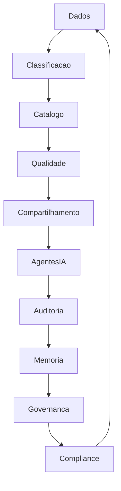

# ADR-0005 — Governança de Dados

- **Status:** Aceito
- **Data:** 2026-07-27

## Contexto

O Projeto Jason é uma plataforma corporativa orientada por Inteligência Artificial composta por múltiplos agentes, departamentos e diretorias, que compartilham informações estratégicas, operacionais, técnicas e de conhecimento. A operação da organização depende diretamente de dados precisos, atualizados, seguros e consistentemente governados.

À medida que a plataforma cresce, a quantidade e a complexidade dos dados aumentam de forma exponencial. Dados deixam de ser simples artefatos técnicos e passam a constituir um ativo estratégico da organização, essencial para tomada de decisão, execução operacional, desenvolvimento de produtos, treinamento de modelos, governança da IA, auditoria, segurança e continuidade do negócio.

Nesse cenário, torna-se indispensável uma arquitetura corporativa de governança de dados capaz de garantir qualidade, consistência, rastreabilidade, segurança, conformidade e reutilização das informações. Sem esse arcabouço, o Projeto Jason corre o risco de operar com dados fragmentados, inconsistentes e pouco confiáveis, comprometendo tanto a eficiência operacional quanto a confiabilidade institucional.

## Problema

Sem uma governança formal de dados, a organização enfrenta riscos significativos que comprometem a execução, a confiança e a escalabilidade da plataforma. Entre os principais problemas estão:

- duplicação de dados entre sistemas, departamentos e agentes;
- inconsistência entre fontes e versões de informação;
- perda de histórico e contexto de decisão;
- baixa confiabilidade das informações utilizadas em análises e automações;
- decisões baseadas em dados incompletos, desatualizados ou incorretos;
- falta de rastreabilidade sobre origem, transformação e uso dos dados;
- risco de não conformidade com requisitos legais e regulatórios, especialmente em relação à LGPD;
- dificuldade de auditoria e revisão de eventos e processos;
- elevado acoplamento entre sistemas e processos, dificultando a evolução da arquitetura.

Esses problemas não afetam apenas a tecnologia, mas também a governança corporativa, a segurança, a integração entre áreas e a confiabilidade do ecossistema de IA.

## Decisão

Definir que toda a plataforma do Projeto Jason utilizará uma arquitetura corporativa de Governança de Dados baseada nos seguintes princípios:

- dado único como fonte da verdade (Single Source of Truth);
- ownership claramente definido;
- catálogo corporativo de dados;
- classificação das informações;
- versionamento;
- auditoria;
- rastreabilidade completa;
- políticas de retenção;
- políticas de acesso;
- qualidade dos dados;
- observabilidade;
- monitoramento contínuo.

Essa decisão estabelece que os dados serão tratados como ativos corporativos, com responsabilidade formal, ciclo de vida controlado, políticas de uso e mecanismos de proteção. A governança de dados passa a ser um componente estrutural da arquitetura empresarial e da arquitetura de IA do Projeto Jason.

## Princípios

### Integridade
A integridade dos dados é um princípio fundamental. Ela garante que as informações sejam completas, coerentes, válidas e preservadas sem adulteração indevida. A integridade é essencial para evitar corrupção de dados, inconsistências entre sistemas e uso indevido de informação.

### Consistência
A consistência assegura que os dados sejam representados de forma uniforme em diferentes contextos, sistemas e processos. Isso reduz divergências, melhora o entendimento do ecossistema e suporta decisões confiáveis em toda a organização.

### Disponibilidade
Os dados devem estar disponíveis para os usuários, departamentos e agentes autorizados no momento certo e com a qualidade necessária. A disponibilidade é importante para a execução operacional, a continuidade do negócio e o funcionamento dos processos automatizados.

### Segurança
A segurança dos dados é requisito essencial para proteção da organização, dos usuários, dos clientes e dos parceiros. Trata-se de garantir confidencialidade, integridade e disponibilidade por meio de mecanismos técnicos, procedimentais e organizacionais.

### Privacidade
A privacidade exige que os dados pessoais e sensíveis sejam tratados com base em princípios de minimização, necessidade, consentimento, finalidade e proteção. A governança de dados precisa assegurar que o uso de dados respeite a lei e os padrões internos de proteção.

### Compartilhamento controlado
O compartilhamento de dados não deve ser irrestrito. Ele deve ocorrer de forma controlada, com base em necessidade de acesso, autorização, contexto e responsabilidade. Esse princípio reduz riscos de vazamento, uso indevido e perda de rastreabilidade.

### Governança
A governança de dados consiste na definição de papéis, decisões, políticas, processos e controles que orientam o ciclo de vida dos dados. Ela proporciona coerência organizacional e clareza sobre quem é responsável pelo que.

### Transparência
A transparência garante que o processo de uso, movimentação, transformação e consumo dos dados seja compreensível, documentado e rastreável. Isso aumenta a confiança institucional e facilita auditoria e revisão.

### Auditoria
A auditoria permite verificar se as políticas, controles e processos de governança foram aplicados corretamente. Ela é essencial para compliance, análise de incidentes, revisão de decisões e evolução contínua.

### Evolução contínua
A governança de dados não é um estado estático. Ela deve evoluir continuamente à medida que a organização cresce, surgem novos modelos de IA, novos sistemas e novas obrigações regulatórias. A evolução contínua garante que a governança permaneça alinhada à realidade operacional.

## Papéis e Responsabilidades

### Diretoria de Dados
A Diretoria de Dados é responsável por definir a estratégia corporativa de dados, coordenar políticas, manter o catálogo corporativo, supervisionar a qualidade e garantir a coerência entre fontes e consumidores.

### Diretoria de Segurança
A Diretoria de Segurança é responsável por proteger os dados contra acesso indevido, vazamento, perda e manipulação maliciosa. Também atua no desenho de controles, políticas de segurança e processos de recuperação.

### Diretoria de Infraestrutura
A Diretoria de Infraestrutura é responsável pela disponibilidade operacional dos ambientes, armazenamento, conectividade, backup, recuperação, resiliência e escalabilidade dos sistemas que suportam os dados.

### Diretoria de Inteligência Artificial
A Diretoria de Inteligência Artificial é responsável por garantir que os dados utilizados em modelos, agentes e automações sejam adequados, representativos, governados e rastreáveis. Também participa do controle de qualidade dos dados usados para treinamento, validação e inferência.

### Diretoria de Memória e Conhecimento
A Diretoria de Memória e Conhecimento é responsável por assegurar que os dados transformados em conhecimento institucional sejam preservados, contextualizados, indexados e recuperáveis pelos agentes e colaboradores da organização.

### Departamentos consumidores
Os departamentos consumidores são responsáveis por utilizar os dados de forma compatível com as políticas corporativas, fornecer feedback sobre qualidade, manter padrões de uso e respeitar os critérios de classificação e acesso.

### Agentes de IA
Os agentes de IA devem operar com base em dados governados, respeitar as políticas de acesso, registrar a origem das informações, preservar a rastreabilidade e não utilizar dados sem autorização ou contexto adequado.

### Usuários corporativos
Os usuários corporativos são responsáveis por acessar os dados somente para fins autorizados, seguir políticas de segurança e qualidade e contribuir para a integridade dos processos de uso da informação.

## Classificação dos Dados

A classificação dos dados é um mecanismo essencial para proteção, governança e compartilhamento controlado. O Projeto Jason adota as seguintes categorias:

### Público
Dados que podem ser compartilhados externamente sem risco significativo. Podem ser utilizados em comunicação institucional, marketing, conteúdo público e materiais corporativos.

### Interno
Dados que podem ser usados dentro da organização, mas que não devem ser compartilhados externamente sem autorização. Incluem relatórios internos, documentação operacional e informações de processo.

### Restrito
Dados com sensibilidade intermediária, geralmente acessíveis apenas a determinados grupos. Exigem controles adicionais de acesso e uso.

### Confidencial
Dados sensíveis, cuja exposição pode impactar a organização, seus usuários, parceiros ou a integridade operacional. Requerem proteção robusta, controle estreito e monitoramento contínuo.

### Estratégico
Dados críticos para competitividade, decisões corporativas, arquitetura de IA, segurança, inovação, produtos e continuidade do negócio. Sua exposição ou uso indevido pode impactar diretamente a missão do Projeto Jason.

A classificação define critérios de acesso, retenção, compartilhamento, proteção e tratamento de cada tipo de dado.

## Ciclo de Vida dos Dados

O ciclo de vida dos dados é o conjunto de etapas que orienta seu tratamento desde a criação até o descarte seguro.

### 1. Criação
Os dados são gerados em sistemas, processos, operações, modelos, agentes, interações com usuários ou integrações externas. A criação deve respeitar padrões mínimos de qualidade e documentação.

### 2. Validação
Após a criação, os dados passam por validação de formato, integridade, completude e consistência. A validação reduz o risco de propagação de erros.

### 3. Classificação
Cada dado ou conjunto de dados é classificado conforme sensibilidade, relevância e impacto organizacional. A classificação orienta acesso, retenção e proteção.

### 4. Armazenamento
Os dados são armazenados em ambientes apropriados, com base na classificação, criticidade e necessidade de disponibilidade. O armazenamento deve incluir políticas de backup, redundância e recuperação.

### 5. Compartilhamento
O compartilhamento ocorre apenas quando há necessidade legítima, autorização e contexto adequado. A governança define regras de fluxo, acesso e rastreabilidade.

### 6. Utilização
Os dados são utilizados em operações, relatórios, decisões, automações, treinamento de modelos, produtos e processos. A utilização deve ser registrada e monitorada para garantir conformidade e rastreabilidade.

### 7. Versionamento
O versionamento permite manter histórico de alterações, auditoria e recuperação de estado anterior. É essencial para a integridade e para a segurança da evolução dos dados.

### 8. Auditoria
A auditoria verifica se as políticas foram seguidas, se o uso foi apropriado, se houve desvios e se a informação permanece confiável. É parte central da governança.

### 9. Arquivamento
Dados que não estão mais em uso ativo, mas que precisam de retenção regulatória ou histórica, devem ser arquivados de forma controlada. O arquivamento preserva o valor histórico e atende requisitos legais.

### 10. Descarte Seguro
No fim do ciclo de vida, os dados são destruídos ou anonimizados de forma segura, respeitando políticas de retenção, normas legais e critérios de risco. O descarte seguro evita vazamentos e uso indevido posterior.

## Qualidade dos Dados

A qualidade dos dados é um dos pilares da governança. Os principais indicadores são:

- completude: ausência de campos obrigatórios ou lacunas críticas;
- consistência: alinhamento entre fontes e representações;
- atualidade: atualização em tempo compatível com o uso esperado;
- precisão: correspondência entre o dado e o fato que representa;
- unicidade: ausência de duplicidade indevida;
- integridade: preservação da estrutura e da relação correta entre dados;
- disponibilidade: acesso confiável e oportuno aos dados necessários.

A governança de dados exige monitoramento contínuo desses indicadores, com metas claras e mecanismos de correção.

## Segurança

A segurança dos dados é tratada de forma transversal. Os mecanismos previstos incluem:

- criptografia em trânsito e em repouso;
- controle de acesso por função, papel e necessidade de uso;
- autenticação forte de usuários e sistemas;
- autorização explícita para acesso e operações;
- segregação de funções para reduzir riscos de abuso e erro;
- logs detalhados de acesso, alteração e uso;
- auditoria contínua dos eventos críticos;
- backup periódico e resiliente;
- recuperação de desastre e restauração de serviços.

A segurança não é um componente isolado; ela deve estar integrada ao ciclo de vida dos dados e à arquitetura operacional do Projeto Jason.

## Conformidade

A governança de dados do Projeto Jason deve estar alinhada a padrões e requisitos regulatórios e corporativos, incluindo:

- LGPD, com foco em finalidade, necessidade, consentimento, transparência, retenção e direito dos titulares;
- ISO 27001, com foco em gestão de segurança da informação;
- ISO 27701, com foco em privacidade e proteção de dados pessoais;
- COBIT, com foco em governança, controle e alinhamento com objetivos de negócio;
- DAMA-DMBOK, com foco em melhores práticas de gestão de dados;
- boas práticas corporativas, incluindo padrões de documentação, rastreabilidade e controle.

A conformidade é tratada como uma exigência contínua e não como uma atividade pontual.

## Benefícios

A adoção da governança de dados gera benefícios técnicos e organizacionais, como:

- maior qualidade das informações utilizadas em decisões e automações;
- redução de duplicidade e inconsistência;
- melhor rastreabilidade e auditoria;
- maior segurança e conformidade;
- melhoria da confiabilidade da IA e dos agentes operacionais;
- maior reutilização do conhecimento institucional;
- redução de acoplamento entre sistemas;
- maior previsibilidade operacional;
- melhor suporte à evolução da arquitetura empresarial.

## Consequências

A implementação da governança de dados traz impactos positivos, mas também exige disciplina e investimento organizacional. Entre os impactos esperados estão:

- aumento da maturidade corporativa em relação ao uso da informação;
- maior esforço inicial de modelagem, documentação e padronização;
- necessidade de integração entre áreas e processos;
- exigência contínua de treinamento, revisão e supervisão;
- maior necessidade de controles e métricas;
- mudança cultural em relação ao tratamento dos dados como ativo corporativo.

Os desafios são significativos, mas o resultado esperado é uma organização mais confiável, segura, governável e preparada para evoluir.

## Alternativas Consideradas

### Governança centralizada
Essa abordagem concentra o controle e a decisão em uma única função corporativa. Ela oferece uniformidade, mas pode ser lenta, excessivamente rígida e pouco adaptável a ambientes distribuídos.

### Governança distribuída
Essa abordagem distribui a responsabilidade de governança entre áreas funcionais. Ela oferece maior proximidade operacional, mas pode gerar inconsistência, lacunas e dificuldade de supervisão corporativa.

### Governança híbrida
Essa abordagem combina coordenação central com execução distribuída. Ela é mais flexível e alinhada com a realidade do Projeto Jason, permitindo padronização corporativa sem perder capacidade de adaptação local.

A abordagem adotada pelo Projeto Jason é a governança híbrida, pois combina autoridade central para padrões e políticas com autonomia operacional para os departamentos e agentes, preservando coerência, eficiência e escalabilidade.

## Impacto na Arquitetura Empresarial

Esta decisão influencia profundamente a arquitetura do Projeto Jason em múltiplos níveis.

### Diretorias
A governança de dados reforça a atuação das diretorias ao atribuir responsabilidades claras, padronizar indicadores e apoiar decisão com informação confiável.

### Departamentos
Os departamentos passam a operar com dados governados, melhor categorizados e mais rastreáveis, o que aumenta a consistência entre processos e entregas.

### Processos
O desenho dos processos incorpora regras de qualidade, retenção, auditoria e segurança, tornando a execução mais previsível e alinhada à governança corporativa.

### Agentes
Os agentes de IA passam a depender de dados com contexto, qualidade e rastreabilidade, o que melhora precisão, segurança e confiabilidade das respostas e decisões automáticas.

### Memória Organizacional
A memória institucional se torna mais robusta porque os dados e os contextos passam a ser persistidos com estrutura, histórico e governança.

### Arquitetura de IA
A arquitetura de IA fica mais segura e confiável, pois modelos, agentes e pipelines passam a utilizar dados governados, auditáveis e alinhados ao propósito corporativo.

### Arquitetura de Dados
A arquitetura de dados ganha uma camada organizacional e regulatória, com políticas de classificação, qualidade, catalogação, acesso e retenção definidas formalmente.

## Próximos Passos

Os próximos passos da governança de dados incluem:

- implementação do catálogo corporativo de dados;
- definição formal de ownership por domínio e conjunto de dados;
- implantação de políticas de classificação, acesso e retenção;
- criação de indicadores de qualidade e observabilidade;
- integração da governança de dados com a arquitetura de agentes e memória institucional;
- revisão periódica das políticas e controles;
- expansão da maturidade da governança conforme a plataforma cresce.

## Referências

- ADR-0001
- ADR-0002
- ADR-0003
- ADR-0004
- Manual Mestre
- Arquitetura Empresarial

## Diagrama Mermaid

## Conclusão

A governança de dados é uma decisão estrutural para o Projeto Jason. Ao tratar os dados como ativo estratégico e instituir uma arquitetura corporativa de governança, a organização amplia sua capacidade de decidir, executar, aprender, auditar e evoluir com segurança, consistência e confiança. Essa decisão fortalece a arquitetura empresarial, a arquitetura de IA e a maturidade institucional do Projeto Jason.
