# Organograma do Projeto Jason

## Visão Geral

O Organograma do Projeto Jason representa uma organização empresarial orientada por inteligência artificial, estruturada em torno de um comando central, Jason, e de diretorias especializadas que operam de forma integrada para garantir estratégia, execução, governança, inovação e continuidade operacional.

## Estrutura Organizacional

```mermaid
graph TD
    A[CEO Jason] --> B[Diretoria de Estratégia]
    A --> C[Diretoria de Engenharia]
    A --> D[Diretoria de Inteligência Artificial]
    A --> E[Diretoria de Dados]
    A --> F[Diretoria de Memória e Conhecimento]
    A --> G[Diretoria de Infraestrutura]
    A --> H[Diretoria de Segurança]
    A --> I[Diretoria Financeira]
    A --> J[Diretoria Jurídica]
    A --> K[Diretoria de Marketing]
    A --> L[Diretoria Comercial e Parcerias]
    A --> M[Diretoria de Operações]
    A --> N[Diretoria de Recursos Humanos]
    A --> O[Diretoria de Inovação]
```

## CEO Jason

- Missão: coordenar a arquitetura empresarial, orquestrar agentes, preservar a memória institucional e garantir alinhamento entre estratégia, tecnologia, governança e execução.
- Responsabilidades: supervisão executiva, priorização de iniciativas, integração entre diretorias, governança do ecossistema e evolução da arquitetura.
- Principais departamentos: gabinete executivo, orquestração central, governança corporativa e gestão de relacionamento institucional.
- Agentes responsáveis: Jason, Agente Executivo, Agente de Governança, Agente de Orquestração.

## Diretoria de Estratégia

- Missão: definir direção, metas e prioridades institucionais para o crescimento e a evolução do Projeto Jason.
- Responsabilidades: planejamento estratégico, definição de objetivos, acompanhamento de indicadores, priorização de iniciativas e alinhamento entre visão e execução.
- Principais departamentos: planejamento estratégico, inteligência competitiva, gestão de portfólio e relacionamento institucional.
- Agentes responsáveis: Agente Estratégico, Agente de Planejamento, Agente de Parcerias Estratégicas.

## Diretoria de Engenharia

- Missão: construir e evoluir soluções digitais com qualidade, escalabilidade e aderência à arquitetura institucional.
- Responsabilidades: desenvolvimento de software, arquitetura de sistemas, integração de serviços, gestão de entregas e garantia de qualidade.
- Principais departamentos: engenharia de software, arquitetura técnica, desenvolvimento, qualidade e DevOps.
- Agentes responsáveis: Agente de Engenharia, Agente de Arquitetura, Agente de QA, Agente DevOps.

## Diretoria de Inteligência Artificial

- Missão: desenvolver, governar e aplicar capacidades de IA para ampliar a eficiência, a inteligência e a autonomia do ecossistema.
- Responsabilidades: modelagem, treinamento, avaliação, implantação e supervisão de soluções de IA, além de governança ética e técnica.
- Principais departamentos: pesquisa e desenvolvimento em IA, modelos e aprendizado, avaliação e segurança de modelos.
- Agentes responsáveis: Agente de IA, Agente de Modelos, Agente de Avaliação e Supervisão.

## Diretoria de Dados

- Missão: garantir a disponibilidade, a qualidade e o uso estratégico dos dados da organização.
- Responsabilidades: gestão de dados, integração de fontes, governança de dados, analytics, qualidade e rastreabilidade.
- Principais departamentos: engenharia de dados, governança de dados, analytics e gestão de repositórios.
- Agentes responsáveis: Agente de Dados, Agente de Governança de Dados, Agente de Analytics.

## Diretoria de Memória e Conhecimento

- Missão: preservar, organizar e disponibilizar o conhecimento institucional e o contexto necessário para a tomada de decisão.
- Responsabilidades: gestão da memória institucional, indexação de documentos, recuperação de contexto, preservação de histórico e organização do conhecimento.
- Principais departamentos: memória corporativa, gestão do conhecimento, documentação institucional e recuperação semântica.
- Agentes responsáveis: Agente de Memória, Agente de Conhecimento, Agente de Documentação.

## Diretoria de Infraestrutura

- Missão: fornecer a base tecnológica necessária para operar com estabilidade, disponibilidade e escalabilidade.
- Responsabilidades: ambientes computacionais, redes, serviços em nuvem, observabilidade, resiliência e suporte técnico.
- Principais departamentos: infraestrutura de TI, cloud, operações de plataforma e monitoramento.
- Agentes responsáveis: Agente de Infraestrutura, Agente de Cloud, Agente SRE.

## Diretoria de Segurança

- Missão: proteger os ativos digitais, físicos e informacionais da organização, preservando integridade, confidencialidade e disponibilidade.
- Responsabilidades: segurança da informação, proteção de dados, conformidade, resposta a incidentes e gestão de riscos.
- Principais departamentos: segurança operacional, compliance, resposta a incidentes e proteção de ativos.
- Agentes responsáveis: Agente de CyberSecurity, Agente de Compliance, Agente de Resposta a Incidentes.

## Diretoria Financeira

- Missão: garantir a saúde econômica, a sustentabilidade financeira e o controle dos recursos da organização.
- Responsabilidades: orçamento, previsões, análise de custos, gestão de receitas, controle financeiro e avaliação de investimentos.
- Principais departamentos: finanças corporativas, contabilidade, controle e planejamento financeiro.
- Agentes responsáveis: Agente Financeiro, Agente de Custos, Agente de Planejamento Financeiro.

## Diretoria Jurídica

- Missão: proteger a organização por meio de assessoria jurídica, conformidade e gestão de riscos regulatórios.
- Responsabilidades: análise contratual, gestão regulatória, assessoria legal, proteção patrimonial e suporte a decisões sensíveis.
- Principais departamentos: legal corporativo, contratos, compliance regulatório e risco jurídico.
- Agentes responsáveis: Agente Jurídico, Agente de Contratos, Agente de Compliance Regulatório.

## Diretoria de Marketing

- Missão: fortalecer a presença institucional, a percepção de valor e a comunicação estratégica do Projeto Jason.
- Responsabilidades: branding, posicionamento, comunicação, campanhas e relacionamento com públicos externos e internos.
- Principais departamentos: marketing institucional, comunicação, conteúdo e branding.
- Agentes responsáveis: Agente de Marketing, Agente de Conteúdo, Agente de Branding.

## Diretoria Comercial e Parcerias

- Missão: expandir negócios, desenvolver parcerias e transformar capacidades organizacionais em oportunidades comerciais.
- Responsabilidades: prospecção, relacionamento com clientes, negociações, gestão de parcerias e expansão de mercado.
- Principais departamentos: vendas, relacionamento comercial, parcerias e desenvolvimento de negócios.
- Agentes responsáveis: Agente Comercial, Agente de Relacionamento, Agente de Parcerias Comerciais.

## Diretoria de Operações

- Missão: assegurar a execução contínua, eficiente e rastreável dos processos institucionais.
- Responsabilidades: gestão operacional, acompanhamento de fluxos, suporte aos agentes, melhoria de processos e continuidade dos serviços.
- Principais departamentos: operações, suporte, gestão de processos e excelência operacional.
- Agentes responsáveis: Agente de Operações, Agente de Suporte, Agente de Processos.

## Diretoria de Recursos Humanos

- Missão: estruturar, desenvolver e preservar o capital humano necessário para a operação do ecossistema.
- Responsabilidades: recrutamento, desenvolvimento de pessoas, cultura organizacional, gestão de desempenho e alinhamento de competências.
- Principais departamentos: recrutamento, desenvolvimento organizacional, cultura e gestão de performance.
- Agentes responsáveis: Agente de RH, Agente de Desenvolvimento Organizacional, Agente de Capacitação.

## Diretoria de Inovação

- Missão: estimular a evolução contínua da organização por meio de experimentação, descoberta e incorporação de novas capacidades.
- Responsabilidades: pesquisa, prototipagem, validação de hipóteses, identificação de oportunidades e aceleração de novas soluções.
- Principais departamentos: pesquisa, inovação, experimentação e transformação digital.
- Agentes responsáveis: Agente de Inovação, Agente de Pesquisa, Agente de Experimentação.
