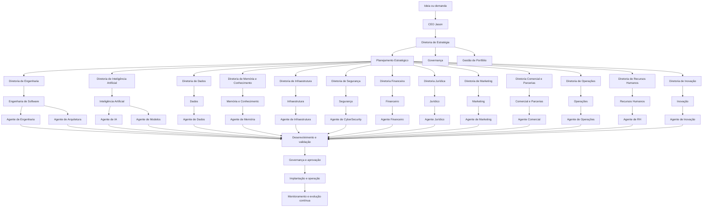

# Processo de Desenvolvimento de Produto de IA

## Objetivo

Garantir que um produto de inteligência artificial seja concebido, avaliado, desenvolvido, validado, implantado e operado de forma alinhada à estratégia institucional, à governança da arquitetura, aos requisitos regulatórios e aos padrões de qualidade do Projeto Jason.

## Escopo

Este processo abrange todo o ciclo de vida de um produto de IA, desde a identificação de uma oportunidade até a operação contínua, incluindo ideação, validação de valor, definição de escopo, desenvolvimento, integração, segurança, governança, implantação, monitoramento, evolução e encerramento ou expansão do produto.

## Evento de início

O processo é iniciado quando uma ideia, demanda de negócio, oportunidade estratégica, necessidade operacional ou proposta de inovação é registrada por uma diretoria, departamento, agente ou stakeholder relevante do ecossistema Jason.

## Entradas

- demanda estratégica ou operacional;
- necessidade de automação, análise ou suporte cognitivo;
- contexto institucional, histórico e memória organizacional;
- requisitos funcionais, técnicos e regulatórios;
- dados, métricas e evidências disponíveis;
- restrições de custo, tempo, segurança e infraestrutura.

## Papéis e responsabilidades

- CEO Jason: valida prioridade institucional, aprova decisões críticas e garante alinhamento entre estratégia, execução e governança.
- Diretoria de Estratégia: define valor, prioridade e coerência com os objetivos corporativos.
- Diretoria de Engenharia: conduz implementação técnica, integração e entrega da solução.
- Diretoria de Inteligência Artificial: define viabilidade cognitiva, modelos, pipelines e supervisão do produto.
- Diretoria de Dados: garante qualidade, governança e disponibilidade dos dados necessários.
- Diretoria de Memória e Conhecimento: fornece contexto, histórico e base de conhecimento institucional.
- Diretoria de Infraestrutura: disponibiliza ambientes, recursos e operação contínua.
- Diretoria de Segurança: avalia riscos, controles e conformidade.
- Diretoria Financeira: valida impacto econômico e viabilidade de investimento.
- Diretoria Jurídica: avalia riscos regulatórios e contratos.
- Diretoria de Marketing e Diretoria Comercial e Parcerias: avaliando posicionamento, adoção e expansão comercial.
- Diretoria de Operações: garante execução, suporte e continuidade operacional.
- Diretoria de Recursos Humanos: acompanha composição de competências e capacitação.
- Diretoria de Inovação: avalia potencial disruptivo e mecanismos de experimentação.

## Fluxo detalhado do processo

## Etapas detalhadas

1. Geração da ideia
   - A ideia é registrada a partir de uma oportunidade de negócio, problema operacional, demanda de usuário ou potencial de automação cognitiva.
   - A Diretoria de Estratégia valida se a proposta é relevante para a organização.

2. Validação de viabilidade
   - São avaliados valor estratégico, impacto operacional, risco, custo, dependências técnicas e viabilidade regulatória.
   - As diretorias de Engenharia, IA, Dados, Memória, Infraestrutura, Segurança, Financeiro e Jurídico contribuem com análise técnica e institucional.

3. Definição do escopo do produto
   - O produto é descrito em termos de objetivo, casos de uso, requisitos, limites, metas de adoção e critérios de sucesso.
   - Os departamentos de Planejamento Estratégico, Governança, Arquitetura Empresarial e Gestão de Portfólio consolidam a proposta inicial.

4. Design do produto e arquitetura
   - São definidos modelo de solução, fluxos de dados, integração com agentes, estrutura de memória, critérios de segurança e requisitos de operação.
   - A Diretoria de Engenharia e a Diretoria de Inteligência Artificial coordenam esse momento com apoio de Dados, Memória e Infraestrutura.

5. Desenvolvimento
   - A solução é implementada com base em requisitos, arquitetura e plano de execução.
   - Engenharia de Software, Inteligência Artificial, Dados, Memória e Infraestrutura atuam de forma integrada.

6. Validação técnica e funcional
   - Os testes incluem validação funcional, qualidade técnica, segurança, observabilidade, integração e usabilidade.
   - Operações, Segurança, Engenharia, IA e Dados participam do processo de validação.

7. Aprovação institucional
   - A proposta é submetida à governança da organização para verificação de impacto, risco, conformidade e alinhamento estratégico.
   - Jason e a governança corporativa aprovam, rejeitam ou solicitam ajustes.

8. Implantação e operação contínua
   - O produto entra em uso operacional com monitoramento, métricas, suporte e evolução contínua.
   - Operações, Infraestrutura, Segurança, Dados e Memória acompanham execução, estabilidade e aprimoramento.

## Diretorias envolvidas

- Diretoria de Estratégia
- Diretoria de Engenharia
- Diretoria de Inteligência Artificial
- Diretoria de Dados
- Diretoria de Memória e Conhecimento
- Diretoria de Infraestrutura
- Diretoria de Segurança
- Diretoria Financeira
- Diretoria Jurídica
- Diretoria de Marketing
- Diretoria Comercial e Parcerias
- Diretoria de Operações
- Diretoria de Recursos Humanos
- Diretoria de Inovação

## Departamentos envolvidos

- Planejamento Estratégico
- Governança
- Arquitetura Empresarial
- Gestão de Portfólio
- Engenharia de Software
- Inteligência Artificial
- Dados
- Memória e Conhecimento
- Infraestrutura
- Segurança
- Financeiro
- Jurídico
- Marketing
- Comercial e Parcerias
- Operações
- Recursos Humanos
- Inovação

## Agentes responsáveis por cada etapa

- Ideação e registro: Jason, Agente Estratégico, Agente de Planejamento
- Validação de viabilidade: Agente Estratégico, Agente de Portfólio, Agente de Governança
- Definição de escopo: Agente de Planejamento, Agente de Arquitetura, Agente de Engenharia
- Design e arquitetura: Agente de Arquitetura, Agente de IA, Agente de Dados, Agente de Memória
- Desenvolvimento: Agente de Engenharia, Agente de IA, Agente de Modelos, Agente de Dados, Agente de Memória
- Validação: Agente de QA, Agente de CyberSecurity, Agente de Operações, Agente de Marketing
- Aprovação: Jason, Agente de Governança, Agente Estratégico
- Implantação: Agente DevOps, Agente de Infraestrutura, Agente de Operações
- Monitoramento e evolução: Agente de Operações, Agente de CyberSecurity, Agente de Dados, Agente de Memória, Agente de Inovação

## Artefatos produzidos

- registro da ideia ou demanda;
- documento de escopo e requisitos;
- proposta de valor e análise de impacto;
- arquitetura de solução e desenho de integração;
- backlog e plano de implementação;
- artefatos de testes, segurança e validação;
- relatório de aprovação institucional;
- documentação de implantação, operação e evolução contínua.

## Indicadores (KPIs)

- tempo médio para validar uma ideia;
- percentual de produtos aprovados dentro do prazo;
- taxa de sucesso de implementação do produto;
- tempo médio de implantação;
- percentual de incidentes pós-implantação;
- índice de adoção pelo usuário ou pela operação;
- grau de alinhamento estratégico da solução;
- percentual de cobertura de segurança e governança.

## Riscos

- falta de clareza de escopo;
- baixa aderência à estratégia institucional;
- dependências técnicas ou regulatórias não mapeadas;
- retrabalho por mudanças tardias;
- falhas de governança, segurança ou rastreabilidade;
- baixa aceitação operacional ou comercial.

## Controles

- registro formal da demanda e da decisão;
- revisão de escopo e impacto antes do desenvolvimento;
- validação técnica, funcional, regulatória e de segurança;
- rastreabilidade documental das etapas;
- aprovação formal antes da implantação;
- monitoramento contínuo pós-entrega com indicadores e evidências.

## Fluxo de aprovação

1. A ideia é registrada e contextualizada.
2. A Diretoria de Estratégia valida prioridade e alinhamento institucional.
3. As diretorias técnicas e operacionais analisam viabilidade, impacto e risco.
4. A governança corporativa revisa conformidade, segurança e impacto estratégico.
5. Jason aprova, rejeita ou solicita ajustes à proposta.
6. A decisão é registrada e comunicada ao conjunto das áreas envolvidas.

## Roadmap de evolução

A evolução futura deste processo deve incluir:

- automação da triagem e priorização de ideias;
- integração com memória institucional e dados governados;
- maior rastreabilidade entre decisão, implementação e impacto;
- reforço da governança de produtos de IA com apoio de agentes especializados;
- aceleração do ciclo de desenvolvimento com maior segurança, qualidade e aderência à arquitetura empresarial.
