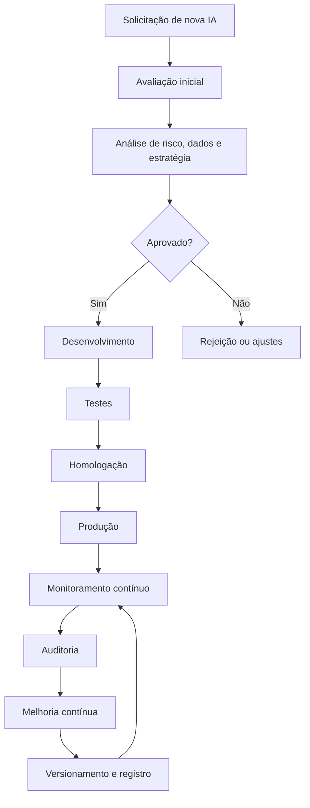

# Processo de Governança de IA

## Objetivo

Estabelecer um processo corporativo formal para selecionar, aprovar, implantar, monitorar, auditar e evoluir soluções de inteligência artificial no Projeto Jason, garantindo alinhamento estratégico, segurança, conformidade, rastreabilidade e valor institucional.

## Escopo

Este processo aplica-se a todos os projetos, produtos, agentes e modelos de IA utilizados pelo Projeto Jason, incluindo soluções de automação, análise preditiva, processamento de linguagem, recomendação, classificação, geração de conteúdo e sistemas de apoio à decisão.

## Princípios da Governança

- Segurança: proteger dados, sistemas, usuários e processos contra riscos operacionais e cibernéticos.
- Ética: assegurar uso responsável, justo e alinhado aos valores institucionais.
- Transparência: documentar critérios, decisões, evidências e limites operacionais.
- Explicabilidade: favorecer entendimento dos resultados e das decisões produzidas por modelos.
- Privacidade: tratar dados pessoais e sensíveis de forma segura, minimizada e compatível com a legislação.
- Conformidade: observar normas internas, regulatórias e políticas corporativas.
- Auditoria: garantir rastreabilidade, registros e revisão periódica das soluções.
- Responsabilidade: definir claramente quem decide, quem executa e quem responde por cada etapa.

## Papéis e Responsabilidades

| Papel | Responsabilidade principal |
| --- | --- |
| Conselho Executivo | Aprova iniciativas críticas, define prioridades estratégicas e valida impactos institucionais. |
| Diretoria de IA | Avalia viabilidade técnica, qualidade do modelo, valor de negócio e governança cognitiva. |
| Diretoria de Governança | Define critérios corporativos, acompanha conformidade e consolida decisões. |
| Diretoria de Segurança | Avalia riscos, controles, incidentes e segurança dos ambientes e dados. |
| Engenharia | Implementa, integra e sustenta as soluções de IA em ambientes operacionais. |
| Dados | Garante qualidade, disponibilidade, rastreabilidade e governança dos dados utilizados. |
| Jurídico | Avalia riscos regulatórios, contratos, proteção de dados e obrigações legais. |
| Operações | Acompanha operação, disponibilidade, suporte e continuidade dos serviços de IA. |

## Fluxo Completo da Governança

### 1. Solicitação de nova IA

A solicitação pode surgir de uma diretoria, departamento, agente ou stakeholder. A proposta deve conter:

- objetivo de negócio ou operacional;
- problema a ser resolvido;
- contexto de uso;
- dados previstos;
- impacto esperado;
- riscos iniciais;
- responsável pelo projeto.

### 2. Avaliação

A proposta é analisada por múltiplas áreas para verificar:

- alinhamento estratégico;
- viabilidade técnica;
- adequação dos dados;
- impacto regulatório;
- risco de segurança e privacidade;
- custo e benefício esperado.

### 3. Aprovação

A solução só avança após aprovação formal por parte do Conselho Executivo ou da governança institucional, conforme criticidade e impacto.

### 4. Desenvolvimento

Nesta etapa, a solução é construída com base em:

- arquitetura definida;
- padrões de segurança;
- governança de dados;
- integração com sistemas e agentes;
- critérios de desempenho e observabilidade.

### 5. Testes

São realizados testes de:

- funcionalidade;
- qualidade de resposta;
- robustez;
- segurança;
- privacidade;
- integração;
- conformidade.

### 6. Homologação

A solução é submetida a validação interna antes da produção, incluindo revisão de evidências, critérios de aceitação e análise de risco.

### 7. Produção

Após a homologação, a solução é implantada em ambiente de produção com controles operacionais, documentação e monitoramento inicial.

### 8. Monitoramento

A execução é acompanhada continuamente por indicadores de desempenho, segurança, qualidade, uso e impacto.

### 9. Auditoria

A solução passa por revisões periódicas e pontuais para validar conformidade, rastreabilidade e adequação ao contexto institucional.

### 10. Melhoria Contínua

Com base em métricas, incidentes e feedback, a solução é revisada, retrabalhada, atualizada ou descontinuada quando necessário.

## Critérios de Aprovação

A aprovação de uma solução de IA deve considerar:

- alinhamento com a estratégia institucional;
- valor esperado para o negócio ou operação;
- qualidade dos dados e contexto de uso;
- impacto em segurança, privacidade e conformidade;
- integridade técnica, disponibilidade e rastreabilidade;
- capacidade de explicabilidade e supervisão humana;
- risco aceitável para a organização.

## Gestão de Riscos

| Tipo de risco | Descrição | Mitigação |
| --- | --- | --- |
| Risco de viés | O modelo pode produzir respostas injustas ou inadequadas. | Avaliação de dados, testes, revisão humana e monitoramento contínuo. |
| Risco de segurança | A solução pode expor dados ou ambientes a ameaças. | Controles de acesso, criptografia, logs e resposta a incidentes. |
| Risco regulatório | O uso pode violar obrigações legais ou políticas internas. | Revisão jurídica, conformidade e registro formal da decisão. |
| Risco operacional | A solução pode falhar ou gerar impacto em processos críticos. | Testes, homologação, monitoramento e planos de contingência. |
| Risco de qualidade | O modelo pode ter baixa precisão, consistência ou confiabilidade. | Avaliação de desempenho, validação e retraining. |

## Gestão de Modelos

Os modelos de IA devem ser tratados como ativos controlados e auditáveis. O processo deve incluir:

- identificação do modelo;
- proprietário responsável;
- dados utilizados no treinamento e validação;
- versão e histórico;
- critérios de desempenho e aceitação;
- limite de uso;
- política de retraining e descontinuação.

## Versionamento

Todo modelo, pipeline, prompt, configuração e artefato associado deve ser versionado. O versionamento deve registrar:

- versão do modelo;
- versão dos dados e metadados;
- alterações de código ou configuração;
- data da publicação;
- responsável pela alteração;
- impacto esperado.

## Monitoramento Contínuo

O monitoramento deve incluir:

- desempenho de precisão e qualidade;
- taxa de erro e anomalias;
- uso de recursos e latência;
- incidentes operacionais;
- observação de comportamento do modelo em produção;
- sinais de drift, degradação e desvio de contexto.

## Indicadores (KPIs)

| Indicador | Descrição |
| --- | --- |
| Taxa de aprovação completa | Percentual de iniciativas aprovadas com todos os registros obrigatórios. |
| Tempo de ciclo | Tempo médio entre solicitação e produção. |
| Taxa de falha operacional | Percentual de incidentes relacionados a modelos ou integrações. |
| Precisão do modelo | Qualidade do modelo em cenário real ou validado. |
| Cobertura de auditoria | Percentual de modelos e projetos avaliados periodicamente. |
| Conformidade regulatória | Grau de aderência a políticas internas e leis aplicáveis. |
| Tempo de resposta a incidentes | Média de tempo para mitigação de problemas de IA. |

## Auditoria

A auditoria deve ser realizada de forma contínua e periódica, cobrindo:

- critérios de aprovação aplicados;
- registros de decisão e evidências;
- qualidade dos dados e do modelo;
- controles implementados;
- incidentes e ações corretivas;
- aderência às políticas internas e à LGPD.

## Conformidade com LGPD

As soluções de IA devem respeitar princípios de minimização, finalidade, transparência, segurança e accountability. Deve-se garantir:

- base legal para tratamento de dados;
- direito de explicação e revisão quando aplicável;
- minimização e retenção controlada;
- proteção de dados pessoais;
- possibilidade de auditoria e rastreabilidade.

## Segurança

Os controles de segurança devem incluir:

- autenticação e autorização;
- segregação de ambientes;
- proteção de dados em trânsito e em repouso;
- logs e rastreabilidade;
- gestão de segredos;
- resposta a incidentes;
- revisão periódica de permissões e acessos.

## Registro de Decisões

Todas as decisões relevantes da governança de IA devem ser formalmente registradas, incluindo:

- identificação da iniciativa;
- data da decisão;
- contexto e justificativa;
- responsável;
- impacto esperado;
- aprovação ou rejeição;
- observações e próximos passos.

## Fluxograma do Processo (Mermaid)

## Boas Práticas

- manter documentação completa de cada solução de IA;
- envolver diferentes áreas antes da aprovação;
- priorizar modelos simples e explicáveis quando possível;
- revisar regularmente o impacto e a qualidade dos resultados;
- guardar evidências de decisão, testes e auditoria;
- manter supervisão humana em decisões críticas.

## Checklist de Implantação

- [ ] Solicitação registrada e documentada.
- [ ] Objetivo, escopo e impacto definidos.
- [ ] Dados validados e governados.
- [ ] Riscos avaliados.
- [ ] Aprovação formal obtida.
- [ ] Testes concluídos.
- [ ] Segurança e conformidade verificados.
- [ ] Monitoramento configurado.
- [ ] Auditoria e versionamento definidos.
- [ ] Responsável operacional designado.

## Referências

- Arquitetura Empresarial do Projeto Jason
- Organograma do Projeto Jason
- Diretoria de Inteligência Artificial
- Diretoria de Governança
- Diretoria de Segurança
- Processo de Desenvolvimento de Produto
- Política institucional de governança e segurança
